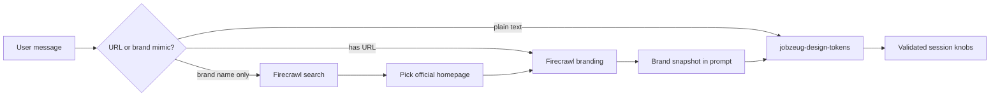

# Brand site → session knobs (same agent)

## Answer to “different path?”

Yes — but only a **preprocess branch**, not a second agent.

Today [`src/app/api/design/tokens/route.ts`](src/app/api/design/tokens/route.ts) is linear: message + knobs → `jobzeug-design-tokens` → structured knobs. Firecrawl does not replace that. It **resolves a site + enriches the prompt**, then the **same** agent still returns knobs.

## Loose brand requests (“mimic State Farm Insurance’s website”)

Yes — that can work **without** the user pasting a URL.

Flow:

1. **No `https://` in the message**, but the text looks like a site-mimic ask (keywords such as `mimic`, `like`, `website`, `site`, `homepage`, plus a brand/org name).
2. **Firecrawl search** for something like `"State Farm Insurance" official website` (reuse `FIRECRAWL_API_KEY`; same family as [job-posting scrape](src/lib/job-posting/scrape.ts)).
3. **Pick one homepage** from top web results with simple heuristics: prefer apex / `www` domains whose title/snippet match the brand; skip app-store, Wikipedia, news, careers, login deep-links when a cleaner marketing homepage exists.
4. **Branding scrape** that URL (`formats: ["branding"]`).
5. Put **resolved URL + brand snapshot** in the prompt; same agent maps to knobs.

If search finds nothing usable, or branding fails: fall through to the normal text-only agent path and say so in the summary (do not invent a brand palette from memory).



Prefer **route-level** detect → search → scrape over a Mastra tool: this agent already uses `structuredOutput` only (no tool loop).

## Web requests (when?)

**Not on every Design Update.** Plain knob asks (“purple primary”, “tighter type”) stay as today: one OpenAI call only — no Firecrawl.

Firecrawl runs **only** when preprocess decides a brand site is involved:

| User ask | Extra network |
|----------|----------------|
| Color / type / space only | None (agent only) |
| Message contains `https://…` | 1× branding scrape |
| “Mimic State Farm’s website” (no URL) | 1× search + 1× branding scrape |

Those Firecrawl calls happen **in the API route before** `agent.generate()` — the design agent itself does not browse. Expect extra latency (and Firecrawl credits) on brand mimics; the UI already has a busy state for Update.

If `FIRECRAWL_API_KEY` is missing or the call fails, skip the snapshot and run the agent text-only (same as today).

## Implementation

### 1. Branding scrape helper

Add `src/design/session-tokens/scrape-branding.ts`:

- Reuse `FIRECRAWL_API_KEY`
- `POST https://api.firecrawl.dev/v1/scrape` with `formats: ["branding"]`
- Return a **trimmed** snapshot: colors, font families, body size, weights, `spacing.baseUnit` — drop logos/components noise
- On missing key / scrape failure: return null; route continues without snapshot

### 2. Brand-site resolve helper

Add `src/design/session-tokens/resolve-brand-site.ts` (or same module):

- Detect mimic intent when there is **no** URL (lightweight regex / phrase check — not a second LLM)
- Extract a search query from the message (strip “can you”, “mimic”, “website”, etc., keep the brand phrase)
- Firecrawl **search** API with a small `limit`
- Rank results → one absolute URL
- If confidence is low (no plausible official hit), return null

### 3. Route preprocess in design tokens API

In [`src/app/api/design/tokens/route.ts`](src/app/api/design/tokens/route.ts):

1. If message has `https?://…` → use that URL
2. Else if mimic-intent → resolve brand → URL
3. If URL → branding scrape
4. Build prompt:

```
Brand snapshot from <url> (Firecrawl):
{ ...trimmed JSON... }

Resolved from user phrasing: "<brand query>"   # only when search was used

User request:
...

When a brand snapshot is present, map the parts the user asked for
(font / colors / space / full restyle). Leave unrelated knobs alone.
Clamp brand colors to mid-tone #RRGGBB. fontFamily must stay in the allowlist;
if their face is not listed, pick the closest allowed family and say so in summary.
```

One agent `generate()` either way.

### 4. Agent instructions

Update [`src/mastra/agents/jobzeug-design-tokens.ts`](src/mastra/agents/jobzeug-design-tokens.ts):

- Prompt may include a **Brand snapshot** (and optional “resolved from” note)
- “mimic / like their website” without further detail → treat as **full restyle** from snapshot (colors + space + type)
- Narrow asks (“just their font”) → only those knobs
- Never invent brand colors if snapshot is missing
- Keep mid-tone + allowlist constraints

### 5. Font allowlist (this pass)

Keep current enum (Geist / Inter / Georgia / system stacks). Map scraped names onto that list. Google Fonts loading is a follow-up; summary notes remaps.

### 6. Isolation

Stay under `src/design/` + Design API route + agent instructions. Do not touch `packages/design-system` or the Resume chat agent.

## Out of scope

- Loading arbitrary Google Fonts at inject time
- Mastra tool / multi-step tool calling on the design agent
- Full Firecrawl “style guide” UI — knobs + summary only
- Perfect brand disambiguation for ambiguous names (e.g. two companies sharing a nickname) — pick best search hit; summary cites the URL so the user can correct
