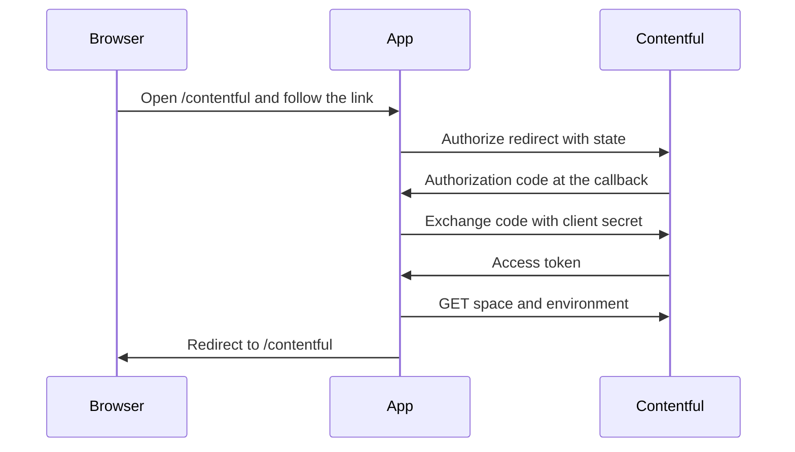

# Contentful OAuth and in-place presentation editing

The site password in [`src/proxy.ts`](src/proxy.ts) keeps gating the app. Contentful login is a second, optional session used only for writes. Visitors who are not signed in to Contentful keep seeing published content through the existing Content Delivery token.

Editing is limited to `jobzeugProjectPresentation` (blurb, two metrics, video). Employers, roles, and project summaries stay owned by evidence Markdown. Compress and push already skip this content type, so an in-app edit will not be overwritten on the next sync.

The app stays bound to `CONTENTFUL_SPACE_ID` and `CONTENTFUL_ENVIRONMENT`. A user who can log in to Contentful but cannot open that space and environment does not get edit controls.

## Contentful app you create

In the Contentful web app, under account profile, developers, applications, create an OAuth application:

- Confidential, so the client secret stays on the server
- One scope: `content_management_manage` (Contentful allows only one scope per request; manage already includes read)
- Redirect URI, paste this exactly: `https://localhost:3000/api/contentful/oauth/callback`
- An expiration on the app (Contentful's UI asks for one; 30 days is a reasonable start)

Add to [`.env.example`](.env.example), and set locally:

- `CONTENTFUL_OAUTH_CLIENT_ID`
- `CONTENTFUL_OAUTH_CLIENT_SECRET`

Do not commit the secret. Leave `CONTENTFUL_MANAGEMENT_TOKEN` for scripts, job postings, and focus briefs. Leave `CONTENTFUL_DELIVERY_TOKEN` for reads.

## Local HTTPS

Next.js 16.3.5 already includes this. No extra package. Change `dev` and `dev:all` in [`package.json`](package.json) from `next dev` to `next dev --experimental-https`.

That serves the app at `https://localhost:3000`. The OAuth start route sends `redirect_uri=https://localhost:3000/api/contentful/oauth/callback`, the same string registered on the Contentful app. The first visit in the browser asks you to trust the certificate Next generates. After that, open the site and `/contentful` on `https://localhost:3000`.

Contentful's public OAuth page still shows the implicit grant (`response_type=token`, token in the URL hash). This app will use the authorization-code grant instead, because a confidential client must exchange a code with the client secret and the token must never reach the browser. If the token endpoint rejects that grant, stop and switch approaches rather than putting the token in page JavaScript.

## URLs

One page, three auth routes, and one write route. Nothing in the resume, nav, or other screens links to the page or offers a sign-in button. After login, the httpOnly cookie is sent with every request, so any server component or API route can allow an edit.

- `GET /contentful` — the only screen. If you are not signed in to Contentful, it shows one link to start login. After you return, it shows who you are and whether this space and environment are open to you, plus a sign-out control. It is not linked from the rest of the app; you open it by URL.
- `GET /api/contentful/oauth/start` — the target of that link. Stores a short-lived `state` cookie and redirects to `https://be.contentful.com/oauth/authorize` with `response_type=code`, the client id, the callback URI, and `scope=content_management_manage`.
- `GET /api/contentful/oauth/callback` — full URL `https://localhost:3000/api/contentful/oauth/callback`. That is the redirect URI registered on the Contentful OAuth app. Checks `state`, exchanges the code at `https://be.contentful.com/oauth/token`, probes the space and environment, sets the cookie, then redirects to `/contentful`. Failures land on `/contentful` with an error query, not a second page.
- `POST /api/contentful/logout` — the sign-out control on `/contentful`. Clears the Contentful cookie and redirects back to `/contentful`. It does not end the site-password session.
- `PUT /api/contentful/presentations/[projectId]` — save blurb, metrics, or a replacement video for `jz-{projectId}-presentation`. Any screen can call it. It accepts the write only when the cookie says this user can access the configured space and environment.

No `GET /api/contentful/session`. Server code reads the cookie through one helper and passes a boolean into client components. The token never goes to the browser.

## Login and access check

- Store the access token in an httpOnly cookie encrypted with `SESSION_SECRET`. There is no refresh token; when it expires, you open `/contentful` and sign in again.
- Probe with that token: `GET /spaces/{CONTENTFUL_SPACE_ID}` and `GET /spaces/{id}/environments/{CONTENTFUL_ENVIRONMENT}`. Contentful returns 404 when the user cannot see that space or environment. Only a 200 on both marks the cookie as allowed to edit.
- The site password still wraps `/contentful` and the callback. You start from an already signed-in site session so the return from Contentful is not bounced to `/login` and the code is not dropped.

Space role still applies. A user who can open the environment but cannot edit entries gets 403 on save, and the write route reports that they can view this environment but cannot change entries.

## In-place edits on /resume-2

Presentation content is on screen in [`src/app/resume-2/stage/answer-stage/connection-hub.tsx`](src/app/resume-2/stage/answer-stage/connection-hub.tsx) (metrics) and [`src/app/resume-2/project-presentation/project-presentation.tsx`](src/app/resume-2/project-presentation/project-presentation.tsx) (video). `/resume` stays read-only. Neither page shows a Contentful sign-in link. If the cookie is missing or this space is closed to that user, the hub looks as it does today.

When the cookie allows editing, that project hub becomes the editor:

- The two metrics turn into inputs in the existing metric row. Limits already in [`scripts/contentful/lib/schema.mjs`](scripts/contentful/lib/schema.mjs): value 16 characters, label 32.
- Blurb (max 600) is loaded in [`src/lib/contentful/delivery.ts`](src/lib/contentful/delivery.ts) but not rendered today. Show it in that same presentation block only while editing, so the read layout stays as it is.
- The video player gets a replace control.

Saves go to `PUT /api/contentful/presentations/[projectId]`, which:

- Requires the editor cookie and a site session
- Loads entry `jz-{projectId}-presentation` with the user token via the existing `contentful-management` client (same id rule as [`scripts/contentful/lib/schema.mjs`](scripts/contentful/lib/schema.mjs) `entryId`)
- Updates localized `en-US` fields and publishes the entry, so the Content Delivery read path shows the change
- Rejects anything that is not blurb, the four metric fields, or a new video asset
- On version conflict (409), asks the client to reload and try again

Video replace follows Contentful's asset steps with the same user token: create the asset, upload the file, process it, link `video` on the presentation entry, then publish the asset and the entry. Text saves do not wait on that.

After a successful publish, the resume view refetches so the hub shows the published metrics and video. The shared management token is not used on this path. A missing OAuth env leaves the editor hidden and does not affect the rest of the app.
