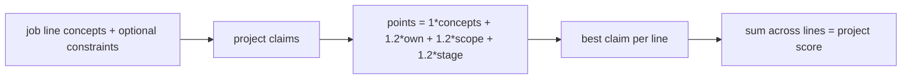

# Cumulative project↔job-line scoring

## Goal

Stop vetoing concept overlaps with constraint filters. Rank projects by **how many positive relationships** they form with job lines: concept hits plus bonus when ownership / scope / delivery_stage also align.

Primary unit: **project ↔ job line**. Rollup: projects with the highest total points win.

## Scoring model (v2)

Weights (defaults you confirmed):

- **+1.0** per exact overlapping `concept_id` (including tool_concept_ids on the line)
- **+1.2** if the line has a non-empty `constraints.ownership` and the claim’s `ownership` is in that list
- **+1.2** same for `constraints.scope`
- **+1.2** same for `constraints.delivery_stage`
- Empty constraint array on that axis → **no points, no veto** (axis ignored)

Rules:

- Only **project-scoped** job lines with concepts participate (candidate lines skipped as today; unmapped/empty concepts → 0 for that line).
- Inferred claims still skipped; same scorable review statuses as today.
- Per project×line: score **each scorable claim**, keep the **best claim** (max points) so one line does not flood the total.
- **Project `score`** = sum of those best-claim points across all participating job lines (raw hits total, not 0–100).
- Drop broader/narrower half-credit for this version — exact id relationships only (keeps the focus you asked for).
- Delete hard `constraintsConflict` skip path.

Bump [`SCORING_VERSION`](src/lib/matching/versions.ts) to **`2.0.0`**.

## Code changes

### 1. Rewrite [`src/lib/matching/score.ts`](src/lib/matching/score.ts)

Replace `assessRequirement` / weighted 0–100 math with:

- `scoreClaimAgainstLine(claim, requirement) → { points, conceptHits, ownershipHit, scopeHit, stageHit, overlapIds, rationale }`
- `bestClaimForLine(project, requirement) → same + evidenceIds`
- Accumulate `project.score` as sum of per-line points
- `contributions[]` only when `points > 0`, carrying the breakdown fields above (plus `requirementId`, `weight` kept as metadata only — **not** multiplied into score)
- `jobLines[].matchSummaries[]`: top projects for that line by **points** (replace `match: 1|0.5` with `points` + breakdown)

### 2. Tests — [`scripts/matching/score.test.mjs`](scripts/matching/score.test.mjs)

Rewrite expectations for cumulative points (e.g. 2 shared concepts → 2; + ownership align → +1.2). Remove tests that assumed constraint veto or 0–100 weighted averages. Keep pending / excluded / unmapped / not_mapped behaviors.

### 3. Docs

- Update formula + field tables in [`src/lib/matching/README.md`](src/lib/matching/README.md)
- Update scoring section in [`evidence/matching/engine.md`](evidence/matching/engine.md) to the additive relationship model (replace 1 / 0.5 / 0 + “all necessary constraints” gate)

### 4. Debug preview — [`src/app/debug/match-concepts/route.ts`](src/app/debug/match-concepts/route.ts)

Keep throwaway, but align with the real scorer:

- Call `scorePostingAgainstCatalog` (or the shared helpers) so green/points match Match
- **Click a job line** (minimal client JS): show that line’s ranked projects from `matchSummaries` / contributions with point breakdown and claim statement
- Header: project ranking by total points; drop “blocked only by constraints” framing; show cumulative totals instead

## Out of scope

- Mapper / ingest changes (constraints can still be written; they now add points instead of vetoing)
- Product resume UI beyond Match JSON + debug page
- Re-introducing broader/narrower credit
- Changing Contentful schemas
