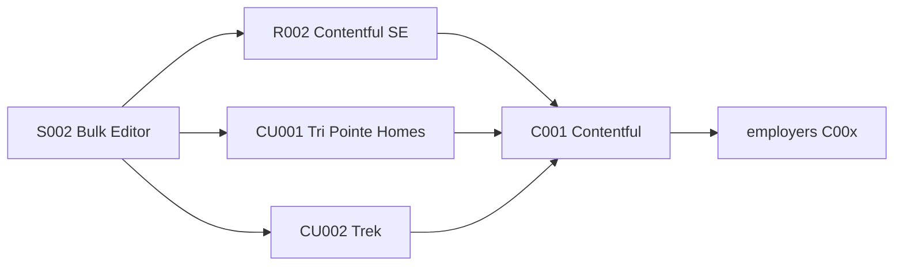

# Employers rename + customers/clients logs

## Relationship types (kept distinct)

| Kind | Folder / IDs | Meaning | Example |
|---|---|---|---|
| Employer | `employers/` **C00x** (prefix kept) | Org that employed Scott | Contentful, Earthling |
| Customer | `customers/` **CU00x** | Buyer of a product/platform Scott was selling, demoing, or adopting with | Tri Pointe Homes, Trek |
| Client | `clients/` **CL00x** | Org that hired Scott’s employer for service/delivery work | Future agency engagements |
| Prospect | *deferred* | Not-yet-closed pipeline | No folder this pass |

**ID rule:** Keep **C00x** for employers (historical “company” prefix). Document in README that C = employer. Do not renumber to E00x. CU/CL stay separate namespaces. Retired C005 remains unused.

Classification: prefer **customer** for sales/SE/product-adoption; prefer **client** for “we were hired to build/deliver.” Ask once if ambiguous. Prospects stay story follow-up notes only.

## Step 1 — Rename `companies/` → `employers/` and heal references

Do this **before** adding customer/client files so new links never point at `companies/`.

1. `mv evidence/companies evidence/employers` (filenames like `C001-contentful.md` unchanged).
2. Sweep and rewrite every markdown path `../companies/` or `companies/` → `employers/` (and encoded variants).
3. Retitle navigation labels for clarity:
   - “Company index” → “Employer index”
   - “Company context:” → “Employer context:” on experience records
   - Index H1 and README section “Company context” → employer wording
4. Inside employer records, keep “company description” / “company overview” where it means the org itself; use “employer” for the relationship type and folder.

### Known reference sites to heal

- All [`evidence/experience/R*.md`](evidence/experience/) “Company context” links (R001–R017 as present)
- [`evidence/experience/INDEX.md`](evidence/experience/INDEX.md)
- Every file under `evidence/employers/` footer links (“Company index” → Employer index)
- [`evidence/employers/INDEX.md`](evidence/employers/INDEX.md) title and intro
- [`evidence/employers/Scale and credibility.md`](evidence/employers/Scale%20and%20credibility.md) wording that says “company” as the folder/type
- [`evidence/README.md`](evidence/README.md) company section and nav
- [`evidence/sources/INDEX.md`](evidence/sources/INDEX.md) company research pointers
- [`.cursor/skills/add-story/SKILL.md`](.cursor/skills/add-story/SKILL.md) context load path
- Grep the whole repo for `companies/` and `Company index` / `Company context` after the rename; fix any stragglers (including story files if any)

Do **not** rewrite historical resume/source snapshot text that uses the word “company” in ordinary English.

## Step 2 — Customers and clients (research parity)

Same research discipline as employer records (e.g. former State Farm pattern): category, description, timeframe limits, dated citations, scale table, suggested descriptor; org research ≠ Scott’s contribution.

**Customers this pass:** full research on CU001 and CU002 + [`evidence/customers/Scale and credibility.md`](evidence/customers/Scale%20and%20credibility.md).

**Clients this pass:** empty [`evidence/clients/INDEX.md`](evidence/clients/INDEX.md) + scale stub documenting the same template; no CL org files yet.

### Named orgs

- **CU001 Tri Pointe Homes** — Bulk Editor V1; sale closed (Scott’s account). Research from investor/official sources (scale, geography, Fortune listings); only include Sumitomo acquisition if primary-confirmed.
- **CU002 Trek** — Bulk Editor V2; sale closed (Scott’s account). Trek Bicycle Corporation; Waterloo WI; prefer Trek-owned sources for scale.
- Disclosure: **not cleared for public application copy** on every CU/CL until Scott clears them.

## Record shape (customers and clients)

1. ID, display name, kind, capture/research dates  
2. Org description + category  
3. Timeframe and limits  
4. Research sources  
5. Scale and credibility markers  
6. Engaged via (employer `C00x` + role `R00x`)  
7. Linked stories  
8. Scott’s account notes  
9. Public disclosure status  
10. Open questions  

## Files to add (after rename)

1. `evidence/customers/INDEX.md`  
2. `evidence/customers/CU001-tri-pointe-homes.md`  
3. `evidence/customers/CU002-trek.md`  
4. `evidence/customers/Scale and credibility.md`  
5. `evidence/clients/INDEX.md`  
6. `evidence/clients/Scale and credibility.md`  

## Files to update (also)

1. `evidence/stories/S002 - Bulk Editor.md` — CU001/CU002; disclosure; dated addition  
2. `evidence/stories/INDEX.md`  
3. `evidence/README.md` — employers/customers/clients nav, namespaces C/CU/CL, research contract, prospects deferred  
4. `evidence/sources/INDEX.md` — employer + CU/CL research pointers  
5. `.cursor/skills/add-story/SKILL.md` — load `employers/INDEX.md`; classify/create/research CU or CL  

## Out of scope

- Renaming C00x → E00x  
- Prospects folder or IDs  
- Seeding CL org records  
- Separate add-customer / add-client / add-employer skills  
- Clearing names for public copy  
- Changing S002 ARR/popularity claim status  
- Rewriting frozen source snapshots’ ordinary use of “company”  
