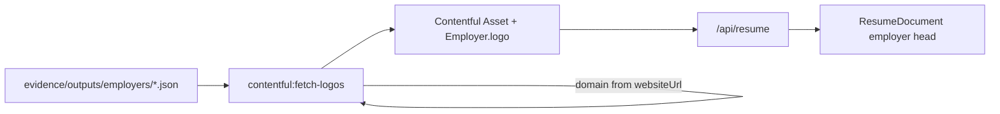

# Employer logo prefetch → Contentful → resume UI

## Scope

Resume employers only (`jobzeugEmployer` / `C00x`). Job-posting company logos are out of scope.

**Logo source (default):** [logo.dev](https://logo.dev) (Clearbit Logo successor). Domain from existing `websiteUrl`; free API token via `LOGO_DEV_TOKEN`. Fallback: skip (no logo) when URL missing or fetch fails — no runtime CDN calls in the SPA.

## Data flow

## 1. Schema: Asset field on employer

In [`contentful/schema.mjs`](contentful/schema.mjs), add optional Asset link on `employer`:

- Field id: `logo`
- Type: Link → Asset
- Then `npm run contentful:apply` so CMA picks it up

## 2. Prefetch + upload script (new)

New script e.g. [`scripts/contentful/fetch-logos.mjs`](scripts/contentful/fetch-logos.mjs) + npm script `contentful:fetch-logos`:

1. Load compressed employers from `evidence/outputs/employers/*.json` (needs `websiteUrl`).
2. Derive hostname (`new URL(websiteUrl).hostname`, strip `www.`).
3. GET logo from logo.dev (`https://img.logo.dev/{domain}?token=…&size=128&format=png`).
4. On 2xx: upload via Contentful CMA (`createUpload` → `createAsset` → `processForLocale` → `publish`). Stable asset id e.g. `jz-{evidenceId}-logo`.
5. Patch employer entry `jz-{evidenceId}` with `fields.logo` → Asset link; publish.
6. Skip if no `websiteUrl`, bad response, or `--dry-run`. Idempotent: reuse existing asset if already present unless `--force`.

Env: existing `CONTENTFUL_*` + `LOGO_DEV_TOKEN`. Document in `.env.example`.

Wire into the compress skill notes ([`.agents/skills/compress-to-contentful/SKILL.md`](.agents/skills/compress-to-contentful/SKILL.md)): after `push`, run `fetch-logos` when employers change.

## 3. Delivery + resume model

- [`src/lib/contentful/delivery.ts`](src/lib/contentful/delivery.ts): resolve `logo` Asset → HTTPS `file.url` on `NormalizedEmployer` (e.g. `logoUrl?: string`). Ensure CDA includes linked assets (`include` on getEntries if not already).
- [`src/lib/contentful/resume-model.ts`](src/lib/contentful/resume-model.ts): pass `logoUrl` onto `ResumeEmployerGroup`.

No change to compress JSON shape — logos live only in Contentful Assets, not in evidence MD.

## 4. UI: small icon beside employer name

In [`src/components/resume-document.tsx`](src/components/resume-document.tsx) + [`resume-document.module.css`](src/components/resume-document.module.css):

- Inside `employerHead` / beside `CitedTitle`: if `logoUrl`, render a small `` (≈16–20px, rounded lightly, `alt=""` decorative).
- Layout: flex row, icon + title, title underline still full width of the head.
- Prefer semantic tokens for size/gap; no new DS components required.

## Out of scope

- Job posting panel company logos
- Runtime logo fetching in the browser
- Writing logo binaries into `evidence/`
- Initials fallback avatar (omit icon if no logo)