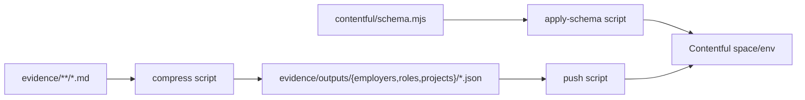

# Evidence → Contentful compress

## Goal

Evidence Markdown stays source of truth. A **compress** step produces deterministic Employer / Role / Project payloads that can render a traditional resume experience block (employer + title + dates + bullets; projects as title-only lists under roles). Push those into Contentful with forced IDs so re-runs stay in sync.

## Content model (resume-shaped, minimal)

Reuse and lightly adjust [`contentful/schema.mjs`](contentful/schema.mjs):

| Type | Fields for this phase | Notes |
|------|----------------------|--------|
| **Employer** | `evidenceId`, `name`, `descriptor?`, `websiteUrl?` | Name + scale descriptor from [`evidence/employers/Scale and credibility.md`](evidence/employers/Scale%20and%20credibility.md) |
| **Role** | `evidenceId`, `employer`, `title`, `dateLabel`, `location?`, `highlights?` | Title/dates from role header; **highlights** = “Existing resume claims” bullets (the resume body). Leave `summary` empty for now |
| **Project** | `evidenceId`, `employer`, `roles`, `name` | **Title only.** Make `summary` optional in schema (currently required) so we do not invent spines yet. Leave highlights/technologies/url empty |

Keep `resume` / `resumeExperience` / `coverLetter` / `jobApplication` definitions in the schema file for later, but **do not compress or push them in this phase**.

**IDs (already designed):**
- Evidence ID: `C001` / `R001` / `S001` stored in `evidenceId`
- Contentful entry ID: `entryId(key)` → `jz-C001` (forced on create/update so sync is stable)

**Role aggregates:** Respect [`contentful/evidence-policy.json`](contentful/evidence-policy.json). Compress **all** roles into outputs; selection of aggregate vs LinkedIn subroles is a later resume-assembly concern.

## Data flow

Intermediate JSON paths match what [`scripts/contentful/local.mjs`](scripts/contentful/local.mjs) already expects: `evidence/outputs/employers/C001.json`, etc. References in JSON stay as evidence IDs (`C001`); `payload()` converts them to Links with `jz-*` entry IDs on push.

## Env (one place)

Add to [`.env.example`](.env.example) and document in README:

- `CONTENTFUL_SPACE_ID`
- `CONTENTFUL_ENVIRONMENT` (e.g. `master`)
- `CONTENTFUL_MANAGEMENT_TOKEN` (CMA; required for apply + push)

No Contentful MCP — CMA via `contentful-management` in Node scripts. You paste space/env/token into `.env` once; scripts read only from there.

## Scripts to add

Under `scripts/contentful/` (extend existing helpers; add CLI entrypoints + npm scripts):

1. **`apply-schema`** — Ensure `jobzeugEmployer` / `jobzeugRole` / `jobzeugProject` content types match `contentTypes()` from schema (create or update fields). Idempotent.
2. **`compress`** — Parse indexes + entity Markdown → write validated JSON under `evidence/outputs/`. Deterministic extractors only (no AI rewrite):
   - Employers: INDEX + Scale descriptors + first research URL when present
   - Roles: header bullets + “Existing resume claims”; employer from INDEX / links (`Cxxx`)
   - Projects: H1 name + Resume connection employer/roles links; **no summary**
3. **`push`** — Load compressed JSON for C/R/S, topological order (employer → role → project), upsert by forced entry id, publish. Repo overwrites CMS (per schema description). Dry-run flag for preview.

npm scripts e.g. `contentful:apply`, `contentful:compress`, `contentful:push`.

Add `contentful-management` dependency.

## Agent skill

Add [`.agents/skills/compress-to-contentful/SKILL.md`](.agents/skills/compress-to-contentful/SKILL.md) (patterned on [`add-project`](.agents/skills/add-project/SKILL.md)):

- Trigger: “compress”, “process into Contentful”, “sync evidence to Contentful”
- Steps: verify env vars → run compress → report counts/diffs → run apply (if types missing) → push → summarize entry IDs written
- Rules: evidence MD is SoT; never invent metrics/stories; projects are title-only; do not push resume/application types yet; fail closed if env missing

## Explicitly out of scope (this phase)

- Next.js resume page / CDA delivery
- Application bundles, provenance gates, cover letters ([`local.mjs`](scripts/contentful/local.mjs) helpers stay for later)
- AI-authored summaries or project body copy
- Customer/client/perspective content types

## Implementation order

1. Schema tweak: optional `project.summary`; confirm field catalog still matches traditional resume needs
2. Env example + README note
3. Compress extractors + write `evidence/outputs/**`
4. CMA apply + push CLIs
5. Skill + smoke-run compress (push when `.env` is filled)
