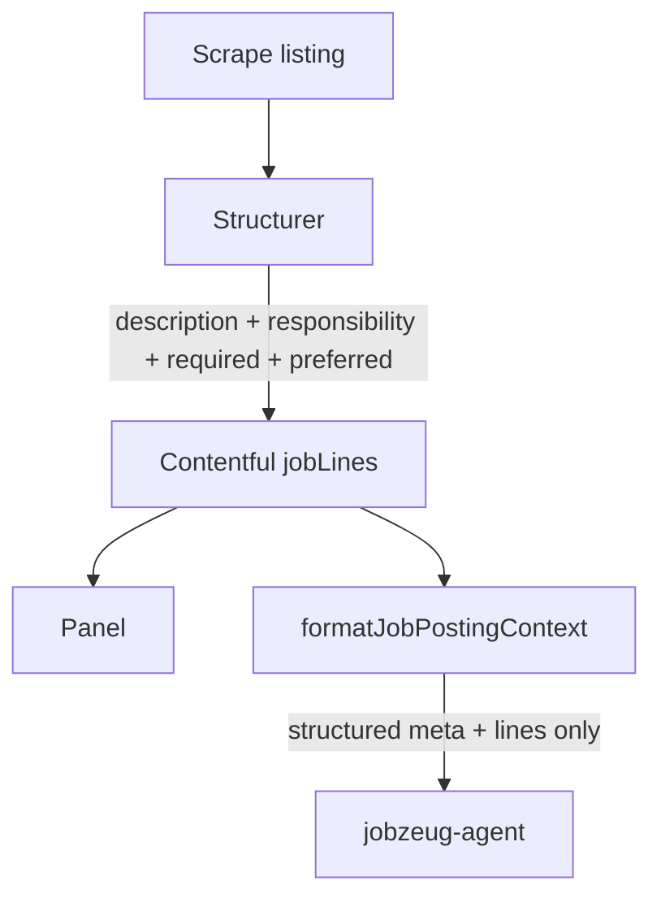

# Structured description paragraphs for job NEED

## Goal

Capture the narrative paragraphs of a job listing as structured, citeable data—same model as requirement lines—so the panel can show them and the agent gets a complete **structured** NEED hand-off. No full-listing dump.

## Problem

- Structurer only extracts responsibility / required / preferred bullets. Role pitch and surrounding prose are not citeable.
- Chat formatter also omits structured meta the panel already has (`compensationNote`, `employmentType`, `travelNote`), so salary questions fail even though the field exists.

## What we are doing

1. **Extract** narrative paragraphs as `jobLine` with `section: "description"` (same Contentful type, same `jz-JP…-line-N` ids, same `citeEvidence.jobLines`).
2. **Show** them in the job panel body: overview/meta → **Description** → Responsibilities → Required → Preferred → Tools.
3. **Hand the agent structured NEED only**: company/title + meta (location, seniority, employment type, years, travel, **compensation**) + Description lines + requirement lines + tools. Keep stripping `fullText` from chat.

## What we are not doing

- Sending `fullText` into the agent system context
- New Contentful content types or new cite fields
- Changing cookie / bind URL shape (re-bind still required to re-extract)

## Implementation

### 1. Schema + structurer

- [`src/lib/job-posting/schema.ts`](src/lib/job-posting/schema.ts) — add `"description"` to `jobLineSectionSchema`
- [`contentful/schema.mjs`](contentful/schema.mjs) — same for `lineSection`; apply schema so CMA accepts it
- [`src/mastra/agents/job-posting-structurer.ts`](src/mastra/agents/job-posting-structurer.ts) — extract 2–8 narrative paragraphs as `section: description` (role overview, team/context, framing). Prefer listing wording. Skip apply forms / EEO / benefits legalese. Keep existing bullet extraction for the other sections. `kind: other` (or soft); short `theme` labels.

Publish path already assigns line entry ids for every structured line—no publish API redesign.

Also ensure compensation (and other meta already in the schema) continues to be extracted into the parent fields so salary lives in structure, not only in prose.

### 2. Panel UI

[`src/components/job-posting/job-posting-panel.tsx`](src/components/job-posting/job-posting-panel.tsx):

- Body order: **overview/meta** → **Description** → Responsibilities → Required → Preferred → Tools
- First `SECTION_ORDER` entry: `{ id: "description", label: "Description" }`
- Same cite/highlight row styling as other lines

### 3. Chat: structured NEED hand-off

[`src/lib/job-posting/contentful.ts`](src/lib/job-posting/contentful.ts) `formatJobPostingContext`:

- Include `employmentType`, `travelNote`, `compensationNote` in the formatted meta
- Emit a **Description** block of citeable `[entryId]` lines, then the existing requirement sections + tools
- Do **not** append `fullText`
- Leave `toChatJobPostingPayload` stripping `fullText` as today

### 4. Agent docs

[`src/mastra/agents/jobzeug-agent.ts`](src/mastra/agents/jobzeug-agent.ts) + [`evidence/Jobzeug.md`](evidence/Jobzeug.md): NEED is structured meta + description lines + requirement lines + tools; cite `jobLines` (including description) for highlights; posting is never Scott evidence.

### 5. Verify

- Re-bind Figma posting so description lines are extracted
- Salary question answered from `compensationNote` (structure)
- Role-framing question can cite a description line; UI highlights it
- Requirement-line highlights unchanged

## Operator note

Already-bound postings need a **re-bind** to get description lines into Contentful.
