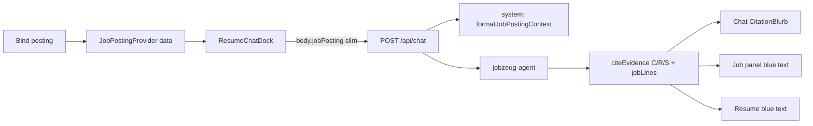

# Job-line citations + evidence purge

## Decisions (locked)

- **Evidence never contains job posts.** Remove [`evidence/job listing/`](evidence/job%20listing/) and scrub agent/docs that treat it as provenance.
- **Bound posting stays out-of-band:** injected as chat `system` context — not via the evidence workspace.
- **Resume chat hand-off:** the browser already loaded the posting in [`JobPostingProvider`](src/components/job-posting/job-posting-context.tsx); pass a slim copy on each chat request instead of re-fetching Contentful.
- **Citations:** extend existing `citeEvidence` with `jobLines` (one tool call; no second tool).
- **Highlighting simplified (not removed):** cited resume titles and job-panel lines get **blue text only** — no bookmark icons, no rollup/Titles modes, no Clear Citations control. Chat still shows `CitationBlurb`.



## Efficiency: what actually slows chat today

| Cost | Source | Impact |
|------|--------|--------|
| **CMA N+1** | [`loadJobPostingByEntryId`](src/lib/job-posting/contentful.ts) on every chat POST | Dominates TTFB before the model runs |
| **Token bloat** | `formatJobPostingContext` appends up to **24k chars of `fullText`** after structured lines | Extra input tokens every turn |
| **citeEvidence itself** | Side-effect-free Zod echo | Negligible if `jobLines` stays on the same tool call |

### Locked approach (fast path)

1. **Client hand-off (resume surface)** — [`ResumeChatDock`](src/components/resume-chat-dock.tsx) reads `useJobPosting().data` and sends a **slim** posting on every `sendMessage` via `DefaultChatTransport` body (e.g. `body: () => ({ jobPosting: slim })` or equivalent AI SDK body option). Slim = meta + `lines` (with `entryId`, text, section, kind, theme) + tools — **omit `fullText`**.
2. **Chat route prefers body** — [`POST /api/chat`](src/app/api/chat/route.ts): if `params.jobPosting` parses as a valid slim view (Zod), call `formatJobPostingContext` on it and **do not** call `loadBoundJobPostingContext`. Strip `jobPosting` from params before spreading into `handleChatStream` so it is not treated as a model message field. Require cookie-bound `entryId` to match `payload.entryId` when a cookie is present (reject mismatch); if unbound and no payload, no job system string.
3. **Fallback only when body missing** — Keep `loadBoundJobPostingContext()` for `/chat` or any call without a body payload (unchanged path; no new in-memory cache work in this plan).
4. **Slim the system string** — Rewrite `formatJobPostingContext` to include `entryId` on each line and **drop the fullText dump**.
5. **One tool** — Put `jobLines` on existing `citeEvidence`. No second cite tool.

Do **not** write postings into `evidence/` or add a server-side posting cache for resume chat.

## 1. Purge job posting from evidence

Delete:

- [`evidence/job listing/`](evidence/job%20listing/) (INDEX, full text, original HTML)

Update references:

- [`evidence/README.md`](evidence/README.md) — drop “Job listing index”; add rule: **job postings are session-bound app data, never stored under `evidence/`**.
- [`evidence/Goal.md`](evidence/Goal.md) — replace `job listing/…` link with Greenhouse URL and/or [`evidence/sources/job-posting-notes.md`](evidence/sources/job-posting-notes.md).
- [`evidence/sources/INDEX.md`](evidence/sources/INDEX.md) — remove link to `../job listing/INDEX.md`.
- [`src/mastra/agents/jobzeug-agent.ts`](src/mastra/agents/jobzeug-agent.ts) — remove “job listing/ are provenance…”; active posting arrives only as request system context.

Keep [`evidence/sources/job-posting-notes.md`](evidence/sources/job-posting-notes.md) (condensed notes, not a full archive).

## 2. Client hand-off + citeable line IDs

Line IDs already exist as `jz-{postingId}-line-N` on [`JobPostingView.lines[].entryId`](src/lib/job-posting/schema.ts).

**Client**

- Add a small `toChatJobPostingPayload(view)` helper (strip `fullText`; keep citeable fields).
- Wire [`ResumeChatDock`](src/components/resume-chat-dock.tsx) transport body from `useJobPosting().data` (null → omit field).

**Server**

- Zod-validate incoming slim payload; format → `params.system`; delete `jobPosting` from stream params.
- Cookie `entryId` must match payload when cookie is set.
- Fallback: existing `loadBoundJobPostingContext()` only if body has no posting.

**Schema / agent**

- Rewrite `formatJobPostingContext` line blocks: `- [id] [theme/kind] text`; drop `fullText`.
- Extend [`citeEvidenceSchema`](src/lib/evidence-citations.ts):

```ts
jobLines: z.array(z.string().regex(/^jz-JP.+-line-\d+$/)).default([])
```

- Update tool description, `emptyCitations`, agent instructions, and context guidance: when a posting is bound, cite relevant **job line IDs** (empty when unbound/irrelevant). Keep C/R/S as today.

## 3. Simplify highlighting (blue only)

**Resume** ([`resume-document.tsx`](src/components/resume-document.tsx)):

- Blue (`primary`) text on cited employer / role / project titles.
- **Remove** `JzIcon` / BookmarkSimple from `CitedTitle`.
- **Remove** rollup mode, stub collapse, scroll-into-view, and `highlightMode` state.
- Leave `id` / `data-evidence-id` anchors for chat hash links.

**Toolbar** ([`resume-play-toolbar.tsx`](src/components/resume-play-toolbar.tsx)):

- Remove Titles/Rollup tabs and Clear Citations. Clearing still happens on new ask / chat Clear via the dock.

**Job panel** ([`job-posting-panel.tsx`](src/components/job-posting/job-posting-panel.tsx)):

- `id={line.entryId}` on each line; cited → blue text only.
- Fold `citations.jobLines` into [`highlightedIds`](src/components/resume-highlight-context.tsx).
- Chat [`CitationBlurb`](src/components/resume-chat-dock.tsx): add a `job lines` group linking to `#${entryId}`.

Drop unused `highlightMode` / `setHighlightMode` from highlight context.

## 4. Out of scope

- Writing any posting markdown into `evidence/`.
- In-memory CMA cache for resume chat (hand-off replaces it).
- Second cite tool or model round-trip for job lines.
- Deleting Contentful job posting entries on unbind.
- Changing `/chat` UI (server fallback remains for that surface).
