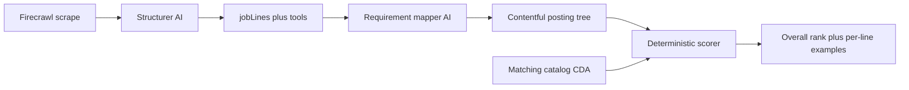

# Job posting matching services

## Approach (locked)

**Forward-only.** This pipeline applies to postings ingested **from implementation onward**. Do not backfill, re-scrape, or migrate existing Contentful job postings. Ignore prior match-engine plans or drafts; this plan is the contract going forward. Old postings without `matchingRequirement` / `matchingSnapshot` simply cannot be scored (return empty/provisional)—no repair job.

Treat today’s **job lines** as the chunks. AI runs **once at ingest** (new scrapes only) and writes durable requirement material onto each line. **Runtime scoring is pure TypeScript** over that material plus `loadMatchingCatalog()`—no LLM, identical inputs → identical scores.

What AI produces (frozen on the posting):

- Per line: requirement fields from [evidence/matching/engine.md](evidence/matching/engine.md) (`concept_ids`, priority/weight, scope, constraints, `mapping_status`, source text/location)
- Tools become concept constraints or tool-concept requirements where vocabulary has an exact tool ID
- Snapshot metadata: vocabulary version, mapper model/prompt version, content hash of source lines

What scoring does at request time (no AI):

- Load posting requirements + published project `matchingMetadata` + vocabulary
- For each project × project-scoped requirement, compute match `1 | 0.5 | 0` with **fixed rules** (below)
- Overall score: `100 * Σ(weight × match) / Σ(weight)` including unmapped as 0
- Per chunk: top contributing projects + supporting claim IDs (the “great examples”)

Match rules v1 (deterministic, no AI judgment ledger yet):

- **1** — approved, non-inferred claim shares at least one required concept and satisfies declared ownership/scope/stage constraints when present
- **0.5** — claim shares a vocabulary broader parent/child of a required concept, or only part of a multi-concept compound requirement
- **0** — no overlap, conflicting constraint, candidate-scoped requirement, or unmapped / empty `concept_ids`
- Strongest assessment per requirement wins; exclude `ranking_eligible: false` and honor pending projects as `score: null` separately

AI assessment overrides (ledger freeze) stay out of v1 so catalog updates (e.g. new S023 tags) re-score immediately.

## 1. Schema and types

Extend Contentful `jobLine` with an optional Object field `matchingRequirement` (same pattern as project `matchingMetadata`). Apply via existing [contentful/schema.mjs](contentful/schema.mjs) + `contentful:apply`.

Add Zod in [contentful/matching-schema.mjs](contentful/matching-schema.mjs) (or sibling) for the engine requirement shape, and mirror into [src/lib/job-posting/schema.ts](src/lib/job-posting/schema.ts) / views so GET/panel/chat can carry it.

Requirement `id` = existing line entry id (`jz-{postingId}-line-N`) for stable cites.

Parent posting: add optional Object `matchingSnapshot` (`vocabularyVersion`, `mapperVersion`, `sourceHash`, `status: provisional|ready`) so the scorer can refuse or label provisional runs.

## 2. AI service — map requirements

New Mastra agent (separate from [src/mastra/agents/job-posting-structurer.ts](src/mastra/agents/job-posting-structurer.ts)): **`job-posting-requirement-mapper`**.

Inputs: structured lines + tools + **approved concept list** from pinned vocabulary (id, label, definition, category, aliases only—trimmed for context).

Output: per-line `matchingRequirement`; leave unknown wording `mapping_status: unmapped` / empty concepts; put net-new ideas in proposals list on the snapshot (do not invent vocabulary IDs).

Wire into ingest in [src/app/api/job-posting/route.ts](src/app/api/job-posting/route.ts) after `structureJobPosting`, before `publishJobPostingTree` updates in [src/lib/job-posting/contentful.ts](src/lib/job-posting/contentful.ts). Keep scrape → structure → **map** → publish as one pipeline for **new** posts only; fail closed if vocabulary cannot load. No batch remap of historical entries.

Do not teach the structurer to invent concept IDs—second pass keeps extraction wording faithful and mapping auditable.

## 3. Deterministic score service

New module e.g. [src/lib/matching/score.ts](src/lib/matching/score.ts):

- `scorePostingAgainstCatalog({ posting, catalog })` → overall ranked projects + `byRequirement` map
- Pure functions; pin `scoringVersion: "1.0.0"`
- Consume `loadMatchingCatalog()` from [src/lib/contentful/matching.ts](src/lib/contentful/matching.ts)
- Eligibility, pending, exclusions, and disclosure filtering per engine (do not publish restricted names in examples)

API: session-gated `GET`/`POST` `/api/job-posting/match?entryId=` returning:

- `scoringVersion`, `vocabularyVersion`, `catalogRevisions`, `status`
- `projects`: ranked `{ projectId, score, contributions, evidenceIds }`
- `byLine`: per chunk `{ lineEntryId, requirementId, matchSummaries }` with top examples
- `unmappedRequirementIds`, `pendingProjectIds`

If the posting has no matching snapshot (legacy ingest), respond with a clear “not mapped” / empty result—do not invent requirements or trigger AI remap on read.

`rationale` for v1 is template-generated from which concepts matched (not LLM prose).

## 4. Tests and acceptance

- Unit tests for score arithmetic (weights 3/3/1 × matches → known totals), broader→0.5, unmapped in denominator, empty requirements → `score: null`, umbrella excluded
- Mapper output schema tests (invalid concept IDs rejected against registry)
- Golden fixture: one fake posting JSON + subset of project headers → snapshot scores

## 5. Explicit non-goals (this pass)

- Backfilling or reprocessing any existing job postings
- Honoring or migrating prior match-engine plans / drafts
- UI for match scores / examples (API + services only)
- Freezing AI 0/0.5/1 assessments onto the posting
- Writing postings or scores into `evidence/`
- Changing annotate-project / compress pipelines
- Fixing compress accidental R014/R015 role pickup on S023 (separate)

## Implementation order

1. Zod + Contentful fields + apply
2. Requirement mapper agent + ingest wiring + persist
3. Deterministic scorer + match API
4. Tests against engine examples
