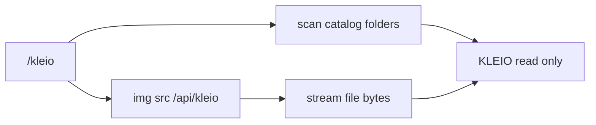

# KLEIO project image index

Read-only scan of `/Users/scottrouse/SYNC/SynologyDrive/KLEIO`: 233 folders, 1,072 images (almost all PNG). Many are repeated exports (`v1`/`v2`/`v4`, `_source`/`_final`, and `2024-09-28-visuals-examples`, which is a copy pile of other folders). The page will show one viable cut per deck, grouped by evidence project from [evidence/projects/INDEX.md](evidence/projects/INDEX.md).

## How images are served

Files stay where they are. A route handler reads a relative path under the KLEIO root and streams it.

- [`src/app/api/kleio/route.ts`](src/app/api/kleio/route.ts) — `GET /api/kleio?path=<relative>`. Resolve with `path.resolve`, reject anything that escapes the root, allow only `png/jpg/jpeg/gif/webp`. No file extension on the URL, so [src/proxy.ts](src/proxy.ts) still requires the existing site session (its matcher skips paths that end in `.png`).
- Root is `process.env.KLEIO_ROOT` or the path above. If the drive is unmounted, the page says so.
- `` points at that route. No `next/image`, no copies into `public/`.

## Catalog

[`src/lib/kleio/catalog.ts`](src/lib/kleio/catalog.ts) lists which KLEIO folders belong to which `S00x` project, plus an include subpath when a folder has several versions. [`src/lib/kleio/scan.ts`](src/lib/kleio/scan.ts) walks only those folders at request time (read-only) and returns `{ id, title, images: [{ label, relativePath }] }`.

Version rule: if a folder has `v4`/`_final`/a later dated export, use that and skip earlier drafts and `-sm` duplicates. Skip `.heic` (the whiteboard already has PNG/JPG copies). Skip `2024-09-28-visuals-examples` entirely.

**Matched**

- **S001 Blueprints** — `2025-11-18 - ExO v3`, `2026-02-26 - ExO Surface`, `2026-04-03-ExO-Comps-4-Questions`, `2026-04-14-blueprints-docs`, `2026-08-13 ExO Design Props`, `2026-08-26 DesktopExO`. Skip ExO v1 (superseded by v3).
- **S002 Bulk Editor** — `2025-06-22 - CTF AI Editor Designs`, `2025-10-06 Entry Flattener`, `2025-11-22 EA Flattener Vertical`, `2026-01-26 - Entry Flattener Horizontal`.
- **S003 DemAI** — DemAI folders (`2025-03-09`, `03-21`, `04-22`, `06-25`, `07-17`, `09-19`, `11-03` latest worksheet only), `2025-03-03 AI Demos`, `2025-09-02-AIMScraper`.
- **S005 State Farm tokens persuasion** — `2023-10-28-Affirm/v4/source` only, plus `2023-10-02-SF-StakeholderWorksheet`.
- **S006 State Farm Figma design system** — `2023-10-04-SFFigmaOrg`, `2023-11-08-SFDesignTokensPlugin`, `2023-10-01-FigmaTokensVisualization`.
- **S007 State Farm Lit engineering bridge** — `2023-08-17-SF-Containment`.
- **S008 Contentful for Figma widget** — `2026-07-17 CFW Intro`, `2026-07-18 CFW Deck`, `2026-09-04-CfFExport`, `2026-01-22 CTF Figma Widget`, `2026-04-23-Figful-Nodes`, `2026-05-18-FigCtfWidget-Planning`, `2026-06-19 CTF Figma Widget - Binding Editor`, `2024-05-21-FigmaToStudio`, `2024-06-06-CTFFigmaTransformations`, `2024-05-21-FigmaCTFStudioTokensPlugin`.
- **S009 AI content and component binding** — `2024-04-10-ContentBinding`, `2026-07-21 Design Intent`, Upslope hackathon folders (`2025-10-29`, `2025-10-30`).
- **S013 Contentful Content Type widget** — `2022-08-08-Figma-Contentful-Content-Modeler`.
- **S014 Design tokens blog** — `2024-05-06-DesignTokenArticle`, `2024-05-15-ArticlePoster`, `2025-06-13 Design Tokens Video`, design-system frames in `2024-06-08-Keyboards`. Skip the May 2025 tokens-video folder (same frames as the article).
- **S019 Summit application design system** — `2019-03-00-SCU-UUX/v00-01` (not the `-sm` copies), one `2019-03-26-SCU-LOUI` file (skip the “copy” duplicates), `2019-08-28-SCU-CarTransferExperience`. The later DS folders have no images.
- **S020 Summit marketing website** — latest presentation under `TODO/SCUWebsite_export/2022-06-20-presentation` (earlier May/June drafts in `TODO/` are the same deck).
- **S021 Rates Central** — latest design export under `TODO/RatesCentral_export/` (`2022-11-09-RCDesigns` and `2022-11-07-adminDesign`). The dated Rates Central folders outside `TODO/` have no images.
- **S022 2024 Partnership Tour** — `2024-10-09 - 2024PartnerTour/v2` plus the v3 cheatsheet. Skip the September tour folder (same slides, earlier).

**Shown as empty** so the gaps are obvious: S010, S011, S012, S015, S016, S017, S018, S023 (only a Shark cover in `_COVERS`, no prototype screens). S023 gets that one cover if it is worth a frame; otherwise it stays empty.

**Unassigned** (still listed, collapsed): Studio/demo/Forrester/JSON-schema/web-component decks, Whoop, org charts, taxonomy, Layout API, and similar work images that do not match an evidence project. Left out: tattoos, lozenge/art, German sheets, still lifes, AHA, tracking todos, and `_COVERS` binders.

## Page

[`src/app/kleio/page.tsx`](src/app/kleio/page.tsx) plus a CSS module. Full-viewport layout using semantic tokens (`--jz-semantic-color-background-*`, text, gap), same idea as the resume shell.

- Left column: project name, then one link per image (filename). Selecting a link sets `?project=S014&image=<index>` so a frame can be reloaded.
- Center: the image, `object-fit: contain`, on a neutral stage sized for screen recording. Arrow keys move to the previous/next image in that project.
- A short line on the home page links to `/kleio`.

## Check skill

As new evidence projects and KLEIO folders show up, an invoke-only skill reports what the index does not cover yet. It does not edit KLEIO, and it does not change the catalog until you say to apply a suggestion.

[`/.agents/skills/check-kleio/SKILL.md`](.agents/skills/check-kleio/SKILL.md), same pattern as [`add-project`](.agents/skills/add-project/SKILL.md): `disable-model-invocation: true`, so it runs when you call `check-kleio` (or ask what is new or missing in KLEIO).

It reads, and only reads:

- `evidence/projects/INDEX.md` for current `S00x` ids and titles
- `src/lib/kleio/catalog.ts` for folders already assigned, marked empty, or deliberately skipped
- Top-level folders under the KLEIO root that contain `png/jpg/jpeg/gif/webp`

Then it reports three lists:

- **New projects** — an evidence project id that is not in the catalog at all (not even as an empty gap)
- **New or missing folders** — a KLEIO folder with images that the catalog neither includes nor lists as skipped (tattoos, art, German sheets, the visuals-examples copy pile, and the other exclusions already in the catalog)
- **Stale catalog rows** — a catalog path that no longer exists, or a folder that used to have images and now does not

For each new folder it suggests a project id when the name is obvious (DemAI, ExO, Rates Central, and so on) and otherwise files it under Unassigned. Applying that suggestion is a follow-up edit to `catalog.ts` only, after you confirm.

