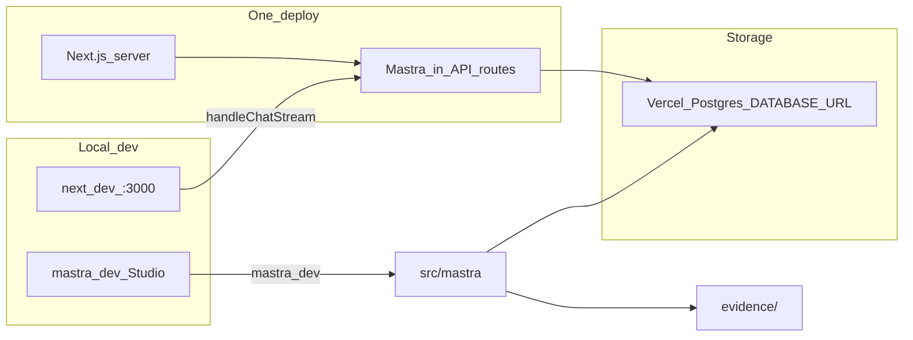

# Next.js + Mastra single-package scaffold

## Shape (no monorepo)

One Node package at the repo root. Keep existing `evidence/`, `session-checkpoints/`, and `.agents/skills/` as siblings of the app code.

```text
jobzeug/
  evidence/                 # markdown knowledge (unchanged)
  session-checkpoints/
  .agents/skills/
  src/
    app/                    # Next.js UI (dynamic shell + chat smoke test)
    app/api/chat/           # streaming agent route
    mastra/                 # agents, tools, Mastra config + Postgres storage
  package.json
  next.config.ts
  .env                      # OPENAI_API_KEY, DATABASE_URL (gitignored)
  .env.example              # documented keys only
```



**Studio vs deploy:** Studio is for **building** locally (`mastra dev`). Production is **one Next.js deploy** with Mastra imported into route handlers ([Mastra Next.js guide](https://mastra.ai/guides/getting-started/next-js), [web-framework deploy](https://mastra.ai/docs/deployment/web-framework)). That matches “one deploy” without a second Mastra-only service. (Standalone `VercelDeployer({ studio: true })` is a different product shape—API + Studio, not your custom Next UI—so we will not use it here.)

**Storage:** Use **Vercel Postgres** (Marketplace-backed Postgres; Neon if that is what Vercel provisions today) via `DATABASE_URL`. Mastra storage is [`PostgresStore` from `@mastra/pg`](https://mastra.ai/integrations/databases/postgresql)—**not** LibSQL. Same `DATABASE_URL` for `next dev`, `mastra dev` (Studio), and production, so memory/threads stay shared.

## Implementation steps

### 1. Scaffold Next.js in-repo

From repo root (existing files stay):

```bash
npx create-next-app@latest . --yes --ts --eslint --tailwind --src-dir --app --turbopack --no-react-compiler --no-import-alias
```

If the CLI refuses a non-empty directory, generate into a temp folder and move `src/`, config files, and `package.json` into the root without touching `evidence/` / session / skills.

Merge [`.gitignore`](.gitignore): keep Contentful backup / `.env` rules; add Next/Mastra defaults (`.mastra/`, etc.). Do **not** rely on a local `mastra.db` file.

### 2. Initialize Mastra + Postgres storage

```bash
npx mastra@latest init
npm install @mastra/pg@latest
```

Non-interactive defaults: **OpenAI** provider; key from env (`OPENAI_API_KEY` in `.env`, already gitignored). Creates `src/mastra/` (config, example agent/tools).

Replace the example weather agent with a thin **`jobzeug-agent`** stub (system prompt: Figma Role evidence workspace; no evidence tools yet—those come later). Wire Studio + Next against that agent id.

**Mastra storage (locked):**

```ts
import { PostgresStore } from '@mastra/pg'

const storage = new PostgresStore({
  id: 'jobzeug-storage',
  connectionString: process.env.DATABASE_URL!,
})

export const mastra = new Mastra({
  storage,
  // agents, …
})
```

- Install `@mastra/pg`; remove / do not use `@mastra/libsql` or file-based LibSQLStore (incompatible with Vercel serverless).
- Use Mastra’s Next.js **singleton pattern** for `PostgresStore` on `globalThis` so HMR does not create duplicate pools ([Postgres + Next.js note](https://mastra.ai/integrations/databases/postgresql)).
- Prefer the **pooled** connection string Vercel/Neon injects when both pooled and direct URLs exist (serverless-friendly).
- Enable SSL when the provider requires it (common for Vercel Marketplace Postgres), e.g. via env or provider defaults in the connection string.
- Schema/tables: let `PostgresStore` auto-`init()` when passed into `Mastra` (threads, messages, workflows, etc.).

**Vercel Postgres setup (manual, documented in README):**

1. In the Vercel project (or Vercel dashboard), add a **Postgres** Marketplace integration (current Vercel path for “Vercel Postgres”).
2. Link it so `DATABASE_URL` is injected for Production / Preview / Development as needed.
3. Pull into local `.env` with `vercel env pull` **or** paste the connection string manually. Never commit `.env`.
4. Add `.env.example` with `OPENAI_API_KEY=` and `DATABASE_URL=` placeholders only.

Provisioning the Marketplace DB itself is a dashboard/CLI step Scott owns; the codebase assumes `DATABASE_URL` is present before `dev` / Studio.

### 3. Wire Next ↔ Mastra

- Install `@mastra/ai-sdk`, `@ai-sdk/react`, `ai` (and AI Elements / Radix as in the official guide only as far as needed for a working chat smoke test).
- Add [`src/app/api/chat/route.ts`](src/app/api/chat/route.ts) using `handleChatStream` → `jobzeug-agent` (memory backed by Postgres).
- Add a minimal [`src/app/chat/page.tsx`](src/app/chat/page.tsx) for agent smoke testing.
- Set [`src/app/page.tsx`](src/app/page.tsx) as a **single dynamic shell** placeholder (one composition viewport)—not a dashboard; chat link or embedded panel later. No product UI polish beyond a clear “Jobzeug” entry.
- `next.config.ts`: `serverExternalPackages: ['@mastra/*']` for Vercel readiness.
- Scripts in `package.json`:
  - `dev` → `next dev`
  - `dev:studio` → `mastra dev`
  - `dev:all` → concurrent Next + Studio (e.g. `concurrently`)
  - `build` / `start` → standard Next (Mastra ships inside the Next server)

### 4. Docs touch-up

Rewrite root [`README.md`](README.md):

- How to run `dev` + Studio (`dev:all`)
- Env: `OPENAI_API_KEY`, `DATABASE_URL` (Vercel Postgres Marketplace)
- That Next and Studio share the same Postgres store
- That `evidence/` is the agent knowledge source (file tools later)
- That production is a single Next deploy with the same `DATABASE_URL`

Do **not** wire evidence file tools or portfolio UI in this pass—scaffold + Studio + Postgres + chat path only.

## Locked defaults

- **Package manager:** npm (matches Mastra docs).
- **No monorepo / no turborepo.**
- **Studio:** local build tool only; not part of the production Next URL.
- **Storage:** `@mastra/pg` `PostgresStore` + Vercel Marketplace Postgres via `DATABASE_URL` (local and prod). **No LibSQL.**
- **Deploy target later:** Vercel-ready config now; no deploy in this task (aside from documenting how to attach Postgres).
- **Model:** OpenAI via existing `.env` pattern.

## Out of scope

- Evidence-reading tools / RAG over `evidence/`
- Polished interactive portfolio page
- Auth on Mastra API
- Production Studio hosting
- Creating the Vercel Postgres instance itself (dashboard / `vercel` CLI by Scott)
- Rewriting git history for the earlier Rollbar HTML false positive
