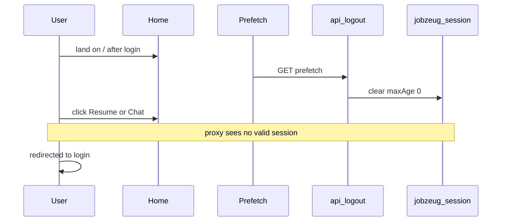

# Fix site password session persistence

## Root cause

The session cookie is already durable (`path: "/"`, `maxAge` 7 days, `httpOnly`, `sameSite: lax`) in [`src/lib/site-auth.ts`](src/lib/site-auth.ts). Proxy gating in [`src/proxy.ts`](src/proxy.ts) treats `/`, `/resume`, `/chat`, and APIs the same.

What kills the session: home puts Log out behind a **Next `Link` to `/api/logout`**, and logout accepts **GET**:

```31:33:src/app/page.tsx
          <Link href="/api/logout" className={styles.secondary}>
            <JzText variant="label" color="inverse" label="Log out" />
          </Link>
```

```17:19:src/app/api/logout/route.ts
export async function GET(req: NextRequest) {
  return POST(req);
}
```

After login, default `next` is `/`. In production, Link viewport/hover **prefetch** issues a GET to `/api/logout`, which clears `jobzeug_session` (`maxAge: 0`). The next navigation looks like “I have to log in every time.”



## Fix (concrete)

1. **Logout API — POST only**  
   In [`src/app/api/logout/route.ts`](src/app/api/logout/route.ts): remove `GET`. Keep POST that redirects to `/login` and clears the cookie with the same attributes as set (incl. `path: "/"`).

2. **Home — POST logout, no Link**  
   In [`src/app/page.tsx`](src/app/page.tsx): replace `<Link href="/api/logout">` with a `<form method="POST" action="/api/logout">` and a submit control styled like the existing secondary action (button or styled submit). Resume/Chat stay as `Link`s.

3. **Sanity**  
   Log in → land on `/` → wait / hover Log out without clicking → navigate to `/resume` and `/chat` — stay authenticated. Explicit Log out still clears and returns to login.

No change to cookie maxAge, proxy matcher, or password env vars. This is not a “persist better” rewrite; stop accidentally clearing a cookie that already persists.