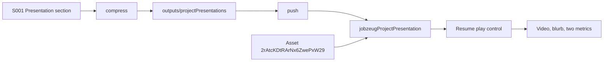

# Project presentation

A project either has a complete presentation or it does not. The presentation does not affect matching scores. Clicking the project name still attaches it to chat. A play control appears only when a presentation exists and opens a near-full modal.

## Content type

Add kind `projectPresentation` in [`scripts/contentful/lib/schema.mjs`](scripts/contentful/lib/schema.mjs). Contentful id is `jobzeugProjectPresentation`. Entry id is `jz-S001-presentation`, so it does not collide with the project entry `jz-S001`.

Fields, all required:

- `evidenceId` — `Sxxx-presentation`
- `project` — link to `jobzeugProject`
- `blurb` — plain text, max 280 characters
- `video` — link to a Contentful **Asset** (not an entry). The id is stored raw, without a `jz-` prefix
- `metricOneValue` / `metricOneLabel` and `metricTwoValue` / `metricTwoLabel` — short symbols (value max 16, label max 32)

[`contentTypes()`](scripts/contentful/lib/schema.mjs) today only emits Entry links. Teach it an Asset link. [`payload()`](scripts/contentful/local.mjs) must emit `{ linkType: "Asset", id: "<assetId>" }` for that field and keep Entry links on `jz-{id}`.

Add the kind to `coreKinds` after `project`, so push creates the project before the presentation that points at it. Outputs land in `evidence/outputs/projectPresentations/`.

## Authoring

Compress reads an optional `## Presentation` section from the project markdown. The block stays out of `matchingMetadata`.

- No section: that project has no presentation.
- A stub (blank video, or blurb/metrics still `REPLACE`): compress skips it. The file can sit unfinished without failing the catalog.
- A filled section (blurb within 280 characters, a real asset id, both metric pairs filled): compress writes the presentation entry. Anything that looks filled but breaks those limits fails compress.

Hello world on [`evidence/projects/S001 - Blueprints.md`](evidence/projects/S001%20-%20Blueprints.md) is the one filled section this pass, so the modal has something to play:

- Video asset `2rAtcKDtRArNx6ZwePxW29`
- A one-line blurb that says this is a playback test
- Two metric boxes with short placeholder value/label pairs

## Stub skill

Add [`.agents/skills/stub-project-presentation/SKILL.md`](.agents/skills/stub-project-presentation/SKILL.md), same shape as the other evidence skills (`disable-model-invocation: true`). Invoke it as stub presentation or stub project presentation, pointed at an existing `S00x`.

The skill only writes a starting `## Presentation` section on that project file:

- Blurb, both metric values, and both metric labels are the token `REPLACE`
- `Video:` is left blank
- It does not invent a story, metrics, or an asset id, and it does not upload or generate a video
- It does not create a project, run compress, or publish
- If the section is already there, it stops and says so

Scott edits the blurb and metrics, and pastes an asset id when a video exists. Until then the resume shows no play control for that project.

## App

[`src/lib/contentful/delivery.ts`](src/lib/contentful/delivery.ts) loads `jobzeugProjectPresentation` with the asset included, and attaches a presentation onto the matching project only when blurb, video URL, and both metrics are present. A protocol-relative Contentful file URL is prefixed with `https:`.

[`src/lib/contentful/resume-model.ts`](src/lib/contentful/resume-model.ts) passes that object through on `ResumeProject`.

In [`resume-document.tsx`](src/components/resume/resume-document/resume-document.tsx), a project with a presentation gets a play icon button. The existing row click is unchanged.

The modal reuses [`src/components/modal/modal.tsx`](src/components/modal/modal.tsx) with a wider size (still inset from the viewport, not edge-to-edge). Layout is the video, then the blurb, then the two metric boxes in a row. The video starts when the modal opens. Close stays the X control.

## Publish

After the type and the S001 section exist: compress, apply the content type, and push so the hello-world entry is published and the resume can play the asset.
