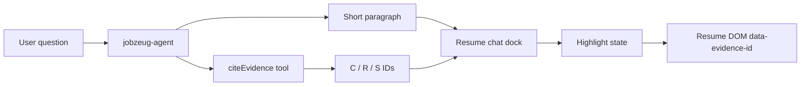

# Resume citations + page highlights

## Goal

Chat answers stay short (about one paragraph). Every assistant turn also emits structured evidence IDs (`C` / `R` / `S`) through a dedicated tool. On `/resume`, those IDs highlight the matching employer / role / project blocks so the document and chat stay in sync.

## Agent: cite tool + tighter instructions

Add [`src/mastra/tools/cite-evidence.ts`](src/mastra/tools/cite-evidence.ts):

- Mastra `createTool` with Zod input:
  - `employers: string[]` (`C\\d{3,}`)
  - `roles: string[]` (`R\\d{3,}`)
  - `projects: string[]` (`S\\d{3,}`)
- Description: required on every user-facing answer; cite only IDs supported by evidence / Contentful core types; empty arrays allowed when nothing applies
- Execute: validate + return the same payload (no side effects)

Wire the tool onto [`src/mastra/agents/jobzeug-agent.ts`](src/mastra/agents/jobzeug-agent.ts) and rewrite instructions to:

- Answer in **one short paragraph** (no long bullet essays unless asked)
- Always call `citeEvidence` with the relevant employer / role / project IDs that support the answer
- Keep using workspace tools to look things up; do not invent IDs
- Note that resume UI highlights from those IDs (so citations must be accurate)

## Resume UI: DOM anchors + shared highlight state

Refactor [`src/app/resume/page.tsx`](src/app/resume/page.tsx) into a thin page shell plus:

- [`src/components/resume-document.tsx`](src/components/resume-document.tsx) — render employers / roles / projects with stable `data-evidence-id` (and matching `id`) on:
  - employer section → `C00x`
  - role block → `R00x`
  - project list item → `S00x`
- Apply highlight styles when the id is in the active citation set (e.g. ring / background on the block)
- Scroll the first newly highlighted node into view

Lift citation state with a small client context (or props from the page):

- [`src/components/resume-chat-dock.tsx`](src/components/resume-chat-dock.tsx) watches `messages`; when the latest assistant message finishes, extract `citeEvidence` tool result parts (AI SDK tool part payload) into `{ employers, roles, projects }`
- Publish that set to the resume document; clear citations on Clear and when the user sends a new message (highlight tracks the latest answer only)

## Out of scope

- Separate resume-only agent (same agent + tool for all surfaces; only resume highlights for now)
- Auto-injecting the Contentful resume JSON into the model context
- Highlighting on `/chat`
