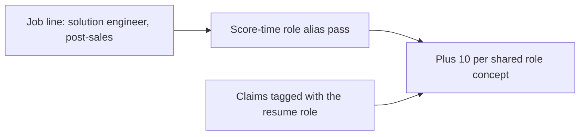

# Resume role tags for job-line scoring

A job line that only says something like “solution engineer” and “post-sales” stays weak because overlap is exact concept IDs, and the vocabulary is skills, tools, and activities. Aliases do not score by themselves. The line has to be tagged with a role concept, and a project claim has to carry the same ID.

## Role concepts (vocabulary 1.6.0)

Add category `role` in [evidence/matching/vocabulary.yaml](evidence/matching/vocabulary.yaml), [evidence/matching/engine.md](evidence/matching/engine.md), and the category enum in [scripts/contentful/matching/project-schema.mjs](scripts/contentful/matching/project-schema.mjs). Bump the registry to **1.6.0**.

One concept per title on the working resume ([evidence/sources/resume-working-copy.txt](evidence/sources/resume-working-copy.txt)), except CTO. Aha Notes stays out (retired). LinkedIn-only titles that are not on that resume stay out. Do not add a CTO or chief-technology-officer concept, and do not tag OpenHomes work (R010 / S029) with a role.

- **Senior Product Architect** (`local:senior-product-architect`) — aliases `product architect`, `post-sales`. This is the resume line about post-sales delivery.
- **Solution Specialist** (`local:solution-specialist`) — aliases `solution engineer`, `solutions engineer`. His title is Solution Specialist; the resume says he partners with solution engineers, and that is the language the job line uses.
- **Senior Software Engineer** — alias `software engineer`
- **Sr. UX Generalist, Design Systems**
- **Senior UX Designer/Developer** — aliases `UX designer`, `UX developer`
- **UX Designer and Web/Mobile Developer**
- **UX/UI Designer and Web/Mobile Developer**
- **Lead Software Developer and UI Designer**
- **Head of Usability / Mobile Developer** — aliases `head of usability`, `mobile developer`

Aliases stay unique against existing labels. Definitions say this is the role he held, not proof of a sales methodology or a customer outcome.

## Put the role on the work

For each project, take **delivery** `role_links` only (skip `calendar_anchor`, so personal widgets stay untagged). Add that role’s concept ID to every scorable claim, and pin those projects’ `annotation.vocabulary_version` to `1.6.0`.

That matters because scoring keeps the single best claim per line. The role tag has to sit on the same claim as the activity tags.

Projects with no linked work (Lead Software Developer) still get a vocabulary concept, so a job line can be tagged. Nothing on the resume will overlap it until a project is linked.

## Make the current job pick them up

Match uses the vocabulary pinned on the posting. A line already mapped under 1.5.0 will not see 1.6.0 concepts unless scoring adds them.

In [src/lib/matching/prepare.ts](src/lib/matching/prepare.ts), [src/lib/matching/score.ts](src/lib/matching/score.ts), and [src/lib/matching/fit.ts](src/lib/matching/fit.ts): after the existing prepare/sanitize pass, append **role** concepts from the newest approved vocabulary when the line text hits a label or alias, even if the line already has other tags. Candidate-only lines (degree, years, city) stay excluded.

Also tell the mapper in [src/mastra/agents/job-posting-requirement-mapper.ts](src/mastra/agents/job-posting-requirement-mapper.ts) to attach role concepts when a line names the job, so later ingests do not depend on the repair pass.

Bump `SCORING_VERSION` to `2.4.0`. Cover the repair and the overlap in [scripts/matching/score.test.mjs](scripts/matching/score.test.mjs).

## Publish

Compress, then matching-only apply and push so the live Match API reads 1.6.0 and the updated claims. The bound posting does not need a re-scrape; the next match call applies the role pass.
