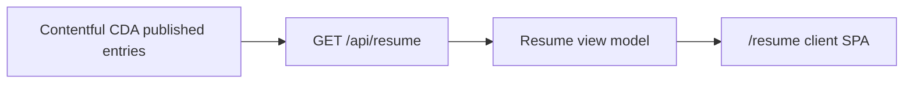

# Resume SPA via Contentful Delivery

## Pipeline (the important part)

- **Write path** (already built): evidence → compress → CMA push
- **Read path** (this work): Contentful Delivery API → Next API route → client SPA

Do **not** call the Management API from the app, and do **not** put the delivery token in the browser. The SPA fetches `/api/resume` only.

## Env

Add to [`.env.example`](.env.example) / README:

- `CONTENTFUL_DELIVERY_TOKEN` — Content Delivery API token for the same space/environment already configured

Reuse existing `CONTENTFUL_SPACE_ID`, `CONTENTFUL_ENVIRONMENT`, and locale default `en-US`.

You create the delivery token once in the Contentful UI (Settings → API keys) and paste it into `.env`.

## Server: delivery client + resume assembler

Add `contentful` (CDA SDK) dependency.

New module e.g. [`src/lib/contentful/delivery.ts`](src/lib/contentful/delivery.ts):

- Create CDA client from env (fail closed if space/env/delivery token missing)
- `getEntries` for `jobzeugEmployer`, `jobzeugRole`, `jobzeugProject` (include links, `limit` high enough for current inventory)
- Normalize to plain objects keyed by `evidenceId`

New assembler e.g. [`src/lib/contentful/resume-model.ts`](src/lib/contentful/resume-model.ts):

- Drop LinkedIn subroles that double-count aggregates using [`contentful/evidence-policy.json`](contentful/evidence-policy.json) (`R014`/`R015` under `R006`, `R016`/`R017` under `R012`)
- Sort remaining roles by `startDate` descending (current roles with no `endDate` stay on top naturally when start is newest)
- Nest each role’s projects (match project `roles` → role `evidenceId`) as title-only list items
- Resolve employer via role → employer link / `evidenceId`
- Return a stable typed shape, e.g. `{ name, experiences: [{ employer, title, dateLabel, descriptor?, highlights[], projects: [{ name }] }] }`

Hardcode `name: "Scott Rouse"` for now (no Resume content type yet).

## API route

[`src/app/api/resume/route.ts`](src/app/api/resume/route.ts) — `GET` returns the assembled JSON. Site password gate already covers API routes the same way as `/api/chat`.

## SPA page

[`src/app/resume/page.tsx`](src/app/resume/page.tsx) — `"use client"`:

- `useEffect` → `fetch('/api/resume')`
- Loading / error states
- Render a simple resume document: name, then experience blocks (employer + title + `dateLabel`, highlight bullets, project titles as a compact list under the role)
- Match existing Jobzeug chrome lightly (link back home); keep typography readable, not a design exercise

Add a link to `/resume` from [`src/app/page.tsx`](src/app/page.tsx).

## Out of scope

- AI rewriting / dynamic twisting (pipeline only returns deterministic CMS data)
- Contact, education, skills, cover letter
- Reading `evidence/outputs` as a fallback (Contentful is the runtime source)
- CMA or compress changes
