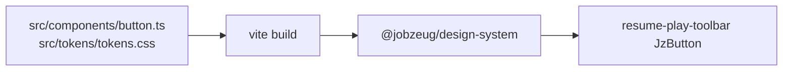

# Rip Specs, restore hand-authored Lit button

## Context

- **DS2 was never installed** in Jobzeug — nothing to undo there.
- **What failed / to remove:** `@directededges/specs-cli` and the Specs-only pipeline (Figma fetch → generated `Bluebutton`, cssvars, Pro license).
- **What to restore:** the completed [Web Components DS](file:///Users/scottrouse/.cursor/plans/web_components_ds_b1737d33.plan.md) shape — hand-written Lit `<jz-button>`, authored `--jz-*` [`tokens.css`](packages/design-system/src/tokens/tokens.css), `@lit/react` `JzButton`. Source for the deleted button still exists in the earlier agent transcript (recover during implement).

Package was never committed as Specs-only; entire [`packages/design-system/`](packages/design-system/) is untracked Specs-era. Rebuild it as the small authored package again.



## Remove (Specs)

From [`packages/design-system/`](packages/design-system/):

- Dep: `@directededges/specs-cli`
- Trees: `config/`, `figma-data/`, `specs/`, `webcomponents/`, `assets/cssvars/`, `styles/entry.css` (Montserrat + cssvars import)
- Scripts: `run-specs.mjs`, `pilot-blue-button.mjs`, `assert-specs.mjs`, `sync-package-from-specs.mjs`, Specs-gated `copy-tokens` / `emit-ve-tokens` / `build.mjs` soft-skip logic
- Package scripts: `specs`, `specs:*`
- Export `./vanilla-extract` (Specs-era VE contract)

From repo root [`package.json`](package.json):

- Drop `ds:specs:fetch|scan|generate|wc|pilot`
- Keep `ds:build` / `ds:dev` / `postinstall` soft build against the authored package

From docs / env:

- Strip Specs/FIGMA/`SPECS_LICENSE_KEY` from [`.env.example`](.env.example), root [`README.md`](README.md), [`packages/design-system/README.md`](packages/design-system/README.md)
- Drop Specs gitignore rules for `figma-data` dumps if present
- Leave user’s real `.env` alone (they can delete unused keys)

## Restore (authored Lit)

Recreate under [`packages/design-system/`](packages/design-system/):

| Path | Role |
|------|------|
| `src/tokens/tokens.css` | `--jz-*` color/space/radius/focus (source of truth) |
| `src/components/button.ts` | `<jz-button>` — `variant` primary/secondary, `disabled`, default slot, real `<button>` + `:hover` / focus-visible |
| `src/index.ts` | register + re-export |
| `src/react/index.ts` | `@lit/react` `JzButton` with `onClick` → `click` |
| `package.json` | exports `.`, `./react`, `./tokens.css` → `src/tokens/tokens.css` (or copied dist path); deps `lit`, `@lit/react` only |
| `vite.config.ts` | lib build of `src` only (no `webcomponents/` in dts include) |
| Simple `scripts/build.mjs` or `vite build` | no Specs assert |

API surface (pre-Specs):

```tsx
<JzButton variant="secondary" disabled={!hasCitations} onClick={...}>
  Clear
</JzButton>
```

## App wire-up

- [`src/components/resume-play-toolbar.tsx`](src/components/resume-play-toolbar.tsx): replace Specs props (`Style`, `ShowIcon`, `Interactive`, `label`) with `variant` / `disabled` / children.
- [`src/app/layout.tsx`](src/app/layout.tsx): keep `import "@jobzeug/design-system/tokens.css"` (now authored `--jz-*`).

## Verify

- `npm install` (lockfile drops directededges)
- `npm run ds:build`
- Resume Clear button: click works, disabled look when no citations, hover via CSS not a prop
