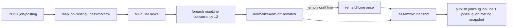

# Robust parallel job-line mapper

## Problem

Today [`mapJobPostingRequirements`](src/lib/job-posting/map-requirements.ts) sends **all ~12 job lines in one** `gpt-4o-mini` call. The agent under-tags and mis-scopes (e.g. dashboards → `candidate` + empty `concept_ids` on the **`jobzeugJobLine` content type** `matchingRequirement` field). Score-time prepare cannot fix meaning-level misses.

Match output already names the fallout correctly: **`unmappedJobLineEntryIds`** — Contentful entry ids for **`jobzeugJobLine` content type** rows that are project-scoped but still have no vocabulary concepts. Do not reintroduce “requirement IDs” language in API or docs.

## Approach

Mastra **workflow + `.foreach`**, one focused map per **job line**, run in parallel. Token burn is fine. Soft rematch: craft-like job lines that come back empty get **one rematch** to do better. **Ingest always succeeds** — empty `concept_ids` (with or without a proposal) is a valid outcome for some lines; never throw, never fail the posting publish over a miss.

## Concrete design

### 1. Single-line mapper agent

Rewrite [`src/mastra/agents/job-posting-requirement-mapper.ts`](src/mastra/agents/job-posting-requirement-mapper.ts) (agent id can stay for continuity; instructions talk about **job lines**):

- **One job line in → one `matchingRequirement` object out** (the Object field stored on the **`jobzeugJobLine` content type**), plus optional `concept_proposals` for *this* line only.
- Model: **`openai/gpt-5.6`** (same class as [`jobzeug-agent`](src/mastra/agents/jobzeug-agent.ts); user OK with tokens).
- Instructions tightened: full vocab list in the prompt; attach every clearly supported ID (1–4 typical); `candidate` **only** for degree / total years / location / auth / clearance / salary; craft/preferred/dashboard/UX → `project`; prefer tagging when the vocab fits; if nothing fits, empty `concept_ids` is OK (optionally emit a `concept_proposal` — not required).

### 2. Mastra workflow

Add [`src/mastra/workflows/map-job-posting-lines.ts`](src/mastra/workflows/map-job-posting-lines.ts) (name reflects job lines, not abstract “requirements”):

| Step | Role |
|---|---|
| `buildLineTasks` | Array of `{ lineIndex, text, section, kind, theme, tools, concepts, vocabularyVersion }` |
| `mapLine` | `agent.generate` + structured Zod for **one** job line’s `matchingRequirement` |
| `.foreach(mapLine, { concurrency: 12 })` | Parallel fan-out (~dozen job lines finish together) |
| `normalizeAndSoftRematch` | Deterministic scope fix + soft empty rematch (below) |
| `rematchLine` | Only for empty craft job lines; stricter “tag or leave empty” prompt; same model; **one attempt max** |
| `assemble` | Order by `lineIndex`, sanitize, build `matchingSnapshot` on the **`jobzeugJobPosting` content type**, set snapshot status |

Register the workflow on [`src/mastra/index.ts`](src/mastra/index.ts). Keep the public function name [`mapJobPostingRequirements`](src/lib/job-posting/map-requirements.ts) as a thin `workflow.createRun().start(...)` wrapper so [`route.ts`](src/app/api/job-posting/route.ts) stays unchanged (internal rename of the file is optional; do not change the export unless needed).

### 3. Soft rematch (never fail ingest)

After each map (and rematch), in code — not the LLM:

1. **Force scope**: if section ∈ `responsibility|required|preferred|description` and text does **not** match the existing candidate-only pattern (same idea as [`prepare.ts`](src/lib/matching/prepare.ts)), set `scope: "project"`.
2. **Soft empty rematch** (project-scoped after step 1): if `concept_ids` empty post-sanitize → queue for rematch **once**, then accept whatever comes back (tagged, empty, and/or proposals).
3. **Never throw** for empty concepts or missing proposals. A miss is not a landmine — publish the line as-is.
4. True candidate job lines (years/degree/location/…) may stay unmapped with empty concepts (scorer skips them; they do not appear in `unmappedJobLineEntryIds`).

After scoring (unchanged contract): project-scoped job lines that still lack concepts land in **`unmappedJobLineEntryIds`**. Snapshot: `status: "provisional"` if any such job line or any proposals; else `"ready"`. That soft signal is how misses surface — not ingest failure. Bump [`MAPPER_VERSION`](src/lib/matching/versions.ts) to `1.1.0`.

### 4. Cleanup

- Remove leftover debug `fetch` ingest logs in `map-requirements.ts` while rewriting.
- Keep unit tests for sanitize/score (already assert `unmappedJobLineEntryIds`); add a small test for the **soft rematch path** (force scope + empty craft job line is accepted, rematch queued once, no throw) without calling the LLM.
- Do not rename Contentful field `matchingRequirement` — that is the CMS field on **`jobzeugJobLine`**. Only keep API/docs language on Match as job-line entry ids.

## Out of scope

- Vocab expansion / dashboard aliases (optional follow-up; not required for this miss).
- Re-scoring math changes.
- Auto remapping already-published postings (user must re-scrape/re-ingest after this ships).
- Further Match API renames beyond `unmappedJobLineEntryIds` (already done).
