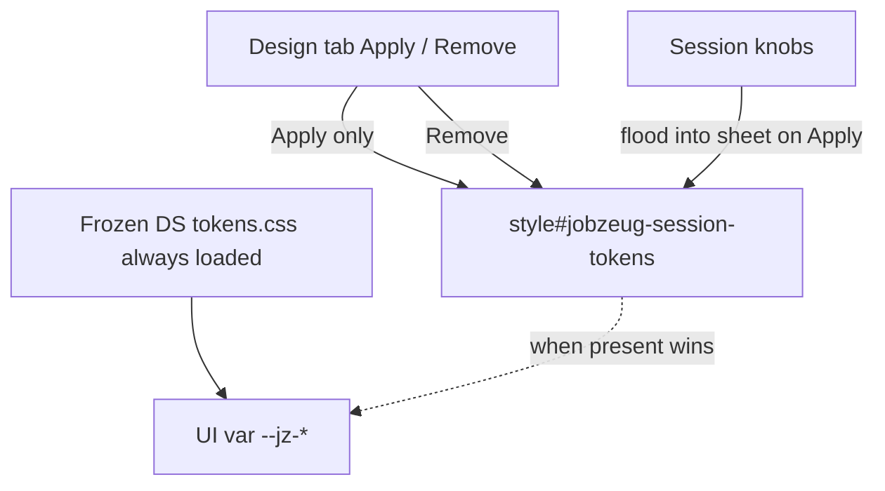

# Session design-token override (Design tab only)

## Premise (locked)

- **[`packages/design-system` `tokens.css`](packages/design-system/dist/designSystem/tokens.css) is frozen.** We do not edit it. It keeps loading from [`src/app/layout.tsx`](src/app/layout.tsx) as the baseline.
- **Override only.** An app-owned sheet redeclares the **same `--jz-*` names**. Knobs flood into derived steps; UI call sites stay unchanged.
- **Not overly dynamic.** Fixed systematic sheet structure; only knobs change.
- **Design tab is the only control surface.** Inject and remove happen **only** from explicit actions in that tab. **Do not** inject on app load, resume mount, or session rehydrate. Default browsing always sees the frozen DS sheet until the user applies the override in Design.

## Isolation (required)

Keep this feature obviously separate from resume Q&A / chat / highlights:

| Own this | Do not scatter into |
|----------|---------------------|
| [`src/design/session-tokens/`](src/design/session-tokens/) — knobs, CSS builder, DOM inject/remove | layout, chat context, highlight context, toolbar |
| [`src/components/design-tab-panel.tsx`](src/components/design-tab-panel.tsx) (+ optional module CSS) — all Design-tab UI and apply/remove state | deep logic inside [`resume-answer-stage.tsx`](src/components/resume-answer-stage.tsx) |

[`resume-answer-stage.tsx`](src/components/resume-answer-stage.tsx) only swaps the Design placeholder for `<DesignTabPanel />`. No global `DesignTokensProvider` that auto-applies on mount. If knobs are remembered in `sessionStorage`, that is for **editing continuity later** — still **no inject until Apply**.

## Goal (this slice)

1. Systematic override CSS from knobs (`--jz-session-primary`, `--jz-session-space` → derived `--jz-*`).
2. Design tab: **Apply session tokens** / **Remove session tokens**.
3. Starting knobs ≈ today’s tokens except **primary = bright red** so Apply is obvious.
4. Clear isolation so this stays a Design-tab experiment.

## Knob → flood → identical names

| Layer | Examples | Who edits |
|-------|----------|-----------|
| Session knobs | `--jz-session-primary`, `--jz-session-space` | Us / future agent |
| Derived in override sheet | `--jz-primitive-color-primary-*`, space ladder, semantic primary/brand remaps | Generated on Apply |
| UI | Same DS names (`--jz-semantic-color-text-primary`, …) | Unchanged |

**Color:** mid primary knob → `oklch(from …)` / `color-mix` steps → semantic primary/brand remaps via `var(--jz-primitive-…)`.

**Space:** one base (`8px`) → `calc(var(--jz-session-space) * n)` for primitive + semantic space the app uses.

**Modes:** primary-related remaps under `[data-mode=…]` so mode toolbar still works **while** the sheet is injected.

## Implementation

### 1. Isolated module — [`src/design/session-tokens/`](src/design/session-tokens/)

- `knobs.ts` — types + defaults (`primary: "#ef4444"`, `space: "8px"`)
- `build-css.ts` — `buildSessionTokensCss(knobs) → string` with `SESSION KNOBS` / `DERIVED` sections
- `dom.ts` — `injectSessionTokens(css)`, `removeSessionTokens()` for `#jobzeug-session-tokens` only; pure helpers, no React, no auto-run
- `index.ts` — public exports for the Design tab panel only

### 2. Design tab panel (all behavior lives here)

[`src/components/design-tab-panel.tsx`](src/components/design-tab-panel.tsx):

- Local state: `applied` boolean (and knobs if needed)
- **Apply** → `buildSessionTokensCss` → `injectSessionTokens`
- **Remove** → `removeSessionTokens` → `applied = false`
- Optional: remember knobs in `sessionStorage` **without** re-injecting on load
- On unmount of the panel: do **not** auto-remove (user may leave the tab while sheet stays until Remove) — or document that Remove is explicit only; prefer **explicit Remove only** so leaving the Design tab does not surprise-clear the override

Wire: Design branch in [`resume-answer-stage.tsx`](src/components/resume-answer-stage.tsx) renders `<DesignTabPanel />` instead of “coming soon”.

### 3. Verify

- Fresh load / Resume tab: frozen DS (blue primary). No override tag in DOM.
- Design → Apply: red primary chrome; `#jobzeug-session-tokens` present.
- Design → Remove: back to frozen DS; tag gone.

## Explicit non-goals

- Auto-inject on load, mount, or navigation
- Global provider that owns lifecycle outside the Design tab
- Editing [`packages/design-system`](packages/design-system)
- Design agent (next)
- Server/Mastra persistence
