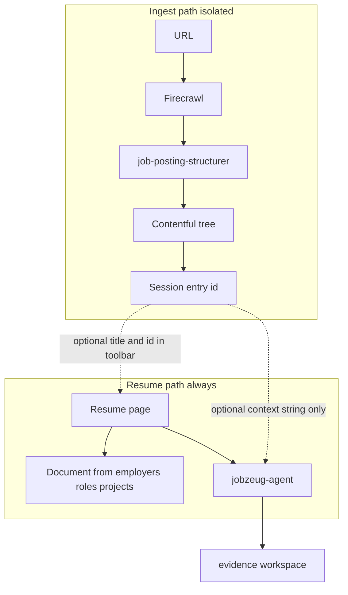

# Session job posting — explicit Contentful shape

## What we are killing

- **`jobApplication`** — filing stub (company, title, URL, one blob, resume/cover letter). Not used. Do not extend it. Do not create cover letters in this flow.
- **Vague names like `jobFacet` / `jobMatch`** — replaced by named sections that mirror how a real posting is written and how you later map to evidence (years, skills, tools, day-to-day work).

## What we are building

Paste a listing URL → [Firecrawl](https://www.firecrawl.dev/) markdown → **dedicated Mastra structurer agent** (not the resume advocate) → Contentful Job Posting tree → session stores Contentful **entry id** → UI shows **title**. Resume and chat work with **no** posting. When bound, [`jobzeug-agent`](src/mastra/agents/jobzeug-agent.ts) gets the structured posting each turn and searches `evidence/` live for C/R/S.

Ingest never writes employer/role/project links.

## Effort, consistency, and what can go wrong

Today Mastra has one agent ([`jobzeug-agent`](src/mastra/agents/jobzeug-agent.ts)): evidence workspace, sell voice, `citeEvidence`, memory. Reusing it for “turn Greenhouse HTML into Contentful fields” fights that prompt and risks leaking evidence into ingest. A second agent is the right cut.

| Piece | Difficulty | Consistency (realistic) | Notes |
|---|---|---|---|
| Firecrawl public Greenhouse URL | Low–medium | **~80–90%** on boards like the Figma link | Login walls / aggressive bot blocks fail; show error + keep resume usable |
| Structurer agent → Zod fields | Low | **~80–90%** with schema + one retry | Headers/company/title are easy; bullet split is usually good; rare merges/splits of bullets |
| CMA publish tree | Low | **~95%** if tokens set | Same path as existing Contentful scripts |
| Session cookie = entry id | Low | **~95%** | Same HMAC pattern as site session |
| Resume without posting | None | **100%** | Do not gate existing `/resume` or `/api/chat` on a posting |
| Inject posting into chat | Low | **~90%** | String context prepend; no new tools required for v1 |
| Click line → highlights | Medium | **~60–75%** cite quality | Depends on evidence coverage; Figma FDE will look strong; random ATS jobs weaker. **Defer click-to-agent if time is tight** — panels can be read-only in v1 |

**Overall for a solid v1 (paste URL → title bound → structured Contentful → chat knows the job):** high confidence, roughly **~75–85%** “just works” on public job-board URLs, with clear failure UI when scrape fails. Not magic; not a research project.

**Keep effort small:** one new agent, one API route, schema + apply, thin resume chrome, chat inject. Skip cover letters, skip pre-linking evidence, skip fancy click UX until the pipe is proven.

## Mastra: dedicated structurer agent (isolated from resume chat)

Register alongside `jobzeugAgent` in [`src/mastra/index.ts`](src/mastra/index.ts), but **do not share instructions, tools, memory, or call paths**.

**`job-posting-structurer`** (own file under `src/mastra/agents/`, e.g. `job-posting-structurer.ts` — not edits stuffed into [`jobzeug-agent.ts`](src/mastra/agents/jobzeug-agent.ts)):

- **Job:** Given `fullText` markdown + `sourceUrl`, return **only** a Zod-shaped object matching Job Posting + `lines[]` (each with `section`) + `tools[]`.
- **No** `evidenceWorkspace`. **No** `citeEvidence`. **No** Memory / observational memory. Stateless generate.
- **Instructions:** Extract; do not invent employers or Scott’s history; prefer posting’s own wording in `text`; set `section` to `responsibility`, `required`, or `preferred`; tag `theme` / `kind` for later search; leave apply-form/EEO/benefits in `fullText` only.
- **Model:** Same family as jobzeug or a cheaper structured model if quality holds; validate with Zod; **one** retry on parse/validation failure, then fail the request.
- **Callers:** Only the job-posting ingest API. Chat must never invoke this agent.

**`jobzeug-agent` (existing):** unchanged voice, tools, and evidence workspace. It does **not** scrape URLs, does **not** write Contentful job trees, and does **not** import structurer code. When the chat route sees a bound entry id, the **chat route** (or a thin `job-posting` loader) fetches Contentful and **prepends** context — that is data injection, not mixing agents. Still required to search `evidence/` and call `citeEvidence`. Must not invent a second posting.

### Code layout (keep this feature in one place)

Prefer a clear folder so “job posting session” is obvious and does not sprawl into resume/evidence:

- `src/lib/job-posting/` — scrape (Firecrawl), Zod schemas, Contentful CMA publish/load for Job Posting tree, session cookie helpers for entry id  
- `src/app/api/job-posting/route.ts` — POST (ingest), GET (bound tree), DELETE/clear (unbind)  
- `src/mastra/agents/job-posting-structurer.ts` — structurer only  
- Toolbar UI: small additions in [`resume-play-toolbar.tsx`](src/components/resume-play-toolbar.tsx) that only call `/api/job-posting`  

Do **not** put Firecrawl or job CMA logic inside [`delivery.ts`](src/lib/contentful/delivery.ts) / [`resume-model.ts`](src/lib/contentful/resume-model.ts) (those stay employer/role/project). Do **not** add job-posting fields to the evidence workspace.

## Why structure (not one markdown blob)

A single `listingText` field is useless for “click this requirement → find my history.” The agent and the UI need **addressable lines**:

| What the posting says | Why it matters for connecting dots |
|---|---|
| Years / seniority (“5+ years…”) | Filter which roles/projects count as senior enough; don’t over-claim. |
| Required skill sets (design systems, TypeScript, MCP, customer-facing) | Search evidence themes and cite C/R/S that prove that skill. |
| Day-to-day responsibilities (“embed with customers”, “make DS agent-ready”) | Map to projects that did that work (e.g. DemAI, Blueprints, Bulk Editor). |
| Preferred / nice-to-haves (Code Connect, Storybook, FDE background) | Softer matches; still highlightable without treating them as must-haves. |
| Tools and stack (TypeScript, Python, MCP, SSO/compliance) | Match tech mentions in project/role records. |
| Location, travel, remote, pay band | Agent context for honest answers; usually not resume highlights. |
| Full raw markdown | Provenance + anything the structure missed (EEO, benefits, apply form). |

## Contentful content types (explicit)

Three types only (plus the existing Employer / Role / Project core — unchanged).

### 1. `jobPosting` (Job Posting) — one entry per pasted URL

Parent entry. The **URL is the ingest key**; Contentful’s **entry id** is what the client session stores after processing succeeds.

| Field | Type | Purpose |
|---|---|---|
| `postingId` | Symbol | Human/stable key we mint (e.g. `JP20260923-6158162004`); also used in entry id `jz-…` if we keep that pattern |
| `sourceUrl` | Symbol | The pasted URL — canonical input that drove this entry |
| `company` | Symbol | e.g. Figma |
| `title` | Symbol | e.g. Forward Deployed Engineer |
| `location` | Symbol | e.g. San Francisco / NY / remote US |
| `employmentType` | Symbol | e.g. full-time (if stated) |
| `seniority` | Symbol | e.g. senior/staff (if stated) |
| `summary` | Text | Short role narrative (first paragraphs), not the whole page |
| `yearsExperienceMin` | Integer | Parsed from “5+ years…” when present; empty if absent |
| `yearsExperienceNote` | Symbol | Exact phrase from the posting for the years bar |
| `travelNote` | Text | e.g. periodic travel to customers |
| `compensationNote` | Text | Pay band / equity blurb if present (agent only; not a highlight chip) |
| `fullText` | Text | **Complete** Firecrawl markdown of the page |
| `lines` | Array of links → `jobLine` | All addressable bullets (duties + must-haves + nice-to-haves) |
| `tools` | Array of links → `jobTool` | Named stacks/tools |

### 2. `jobLine` (Job Line) — responsibility **or** required **or** preferred

One content type for every addressable sentence/bullet from the role body. Distinguish with `section` (same idea as the earlier required/preferred merge).

| Field | Type | Purpose |
|---|---|---|
| `text` | Text | Posting’s own words |
| `section` | Symbol | `responsibility` \| `required` \| `preferred` |
| `kind` | Symbol | `duty`, `years`, `skill`, `domain`, `soft`, `other` (use `duty` for “what you’ll do” lines) |
| `theme` | Symbol | Short label for later search, e.g. `design-systems-ai`, `typescript`, `customer-facing` |

UI and chat group by `section`. No separate Responsibility / Requirement / Preferred Skill types.

### 3. `jobTool` (Job Tool)

Named technologies stay their own type (short `name`, not a long quote).

| Field | Type | Example |
|---|---|---|
| `name` | Symbol | `TypeScript`, `Python`, `MCP`, `Code Connect`, `SSO` |
| `context` | Symbol | Where it appeared: `required`, `preferred`, `responsibility` |

## Worked example (Figma FDE → entries)

After scrape + structure of [this posting](https://job-boards.greenhouse.io/figma/jobs/6158162004):

**Job Posting**

- company: Figma  
- title: Forward Deployed Engineer  
- location: San Francisco, CA · New York, NY · United States (remote US ok)  
- seniority: senior/staff  
- yearsExperienceMin: 5  
- yearsExperienceNote: “5+ years shipping production software end-to-end…”  
- summary: founding FDE team; embed with strategic customers; write product code; reusable paths…  
- fullText: entire Firecrawl markdown (including apply form / EEO / benefits — agent reads; UI does not list those as chips)

**Lines** (`jobLine` children), e.g.:

| section | kind | theme | text (abbrev.) |
|---|---|---|---|
| `responsibility` | `duty` | `design-systems-ai` | Make enterprise DS agent-ready; tokens; Code Connect; evals |
| `responsibility` | `duty` | `product-in-customer-env` | Get Make Local / Code Layers working in customer environments |
| `responsibility` | `duty` | `technical-discovery` | Run technical discovery; toolchain; constraints |
| `responsibility` | `duty` | `llm-workflows` | MCP, agent skills, prompt engineering |
| `responsibility` | `duty` | `reusable-playbooks` | Turn one-offs into playbooks / product feedback |
| `required` | `years` | `seniority` | 5+ years shipping production software… |
| `required` | `soft` | `customer-facing` | Customer-facing communication… |
| `required` | `skill` | `design-systems` | Design systems and design-to-code… |
| `required` | `skill` | `typescript-or-python` | TypeScript/JavaScript or Python + agentic tools |
| `required` | `domain` | `enterprise-security` | SSO, security reviews, compliance… |
| `preferred` | `skill` | `code-connect` | Code Connect, Storybook, Style Dictionary… |
| `preferred` | `domain` | `forward-deployed` | FDE / solutions / DX background… |

**Tools** — TypeScript, Python, MCP, Code Connect, Storybook, Style Dictionary, SSO…

**Not stored as structured children:** apply form fields, EEO survey, long benefits legalese (remain only inside `fullText`).

## Session binding (URL → Contentful id → client)

The **URL** is the only thing the user pastes. After processing, Contentful owns the structured tree. The browser only needs to remember **which Contentful entry** is active.

1. User pastes `https://job-boards.greenhouse.io/figma/jobs/6158162004` (or any listing URL).  
2. Server scrapes + structures + **publishes** the Job Posting tree. Response includes Contentful **entry id** (and title/company for the chrome).  
3. Client session stores that **entry id** (signed httpOnly cookie, same `SESSION_SECRET` pattern as [`src/lib/site-auth.ts`](src/lib/site-auth.ts) — not the raw URL as the sole key, and not a guessable public lookup without the session).  
4. UI chrome shows **job title** for that bound posting (e.g. “Forward Deployed Engineer”), not the full structured dump in the header.  
5. On return (same site session): cookie still has the entry id → `GET /api/job-posting` loads that tree from Contentful Delivery/CMA as appropriate → title + panels come back.  
6. **Change posting:** paste a new URL → new (or re-ingested) Contentful entry → cookie overwritten with the new entry id → UI title updates.  
7. **Clear posting:** drop the cookie / explicit clear → resume returns to no-posting mode (below).

`GET /api/job-posting` returns the tree **only** for the entry id on the cookie. The client does not pass arbitrary Contentful ids to read someone else’s posting.

Do not index into `evidence/`. Do not list these types from the shared resume delivery catalog used for employers/roles/projects.

## Optional posting (resume works without it)

The interactive resume is the default product. A bound Job Posting is an **overlay**, not a dependency.

| Mode | Resume document | Chat | Job panel |
|---|---|---|---|
| **No posting** | Loads as today from employers/roles/projects | Agent uses `evidence/` only; no job context injected | Toolbar: empty URL field, no entry id |
| **Posting bound** | Same resume | Agent gets structured Job Posting + `fullText` every turn | Toolbar: title + Contentful entry id; URL can override |

Chat route and resume page must not 500 or block when the cookie is missing or the entry was deleted. Missing posting = skip inject, skip job panels.

## Ingest

`POST /api/job-posting` `{ url }` (site password session required):

1. Firecrawl scrape → `fullText`; store `sourceUrl`.  
2. Call Mastra **`job-posting-structurer`** with `fullText` + `sourceUrl` → Zod object. Retry once on validation failure.  
3. CMA create/publish tree; set cookie to Contentful **entry id**; return `{ entryId, title, company }`.

On scrape or structure failure: **4xx/5xx with message**; do not clear an existing bound posting unless the user asked to replace and the new one succeeded.

## Real-time connection

- **Chat with bound entry:** inject structured posting into `jobzeug-agent` (existing agent).  
- **Chat without:** unchanged.  
- **Click a line (v1 optional):** either send a canned user message into chat, or skip and ship read-only panels first.

## Resume UI — test controls in the left floating toolbar

Ship the **ingest/bind loop** in the existing left chrome, [`ResumePlayToolbar`](src/components/resume-play-toolbar.tsx) (`position: fixed; bottom: 1rem; left: 1rem`), next to Titles / Rollup / Clear. That is enough to exercise Firecrawl → Contentful → session without a new page.

**Controls (compact):**

1. **URL field** — paste a listing URL (e.g. Greenhouse).  
2. **Bind / Load** — `POST /api/job-posting` with that URL; on success, session cookie gets the Contentful **entry id**; toolbar shows **title** (and company if space) plus the **entry id** as plain text (copyable).  
3. **Show bound state when returning** — on mount, `GET /api/job-posting`; if cookie has an id, display title + entry id without re-scraping.  
4. **Override** — paste a different URL and Bind again → new (or replaced) Contentful entry → cookie overwritten → title/id update.  
5. **Clear** — separate control (or extend existing Clear carefully so highlight-clear stays distinct): drop the posting cookie and blank the title/id; resume/chat keep working with no job context.

**Do not block on** a full responsibilities panel for v1 of this toolbar. Optional later: expand or a small “lines” peek. Primary test signal is: URL in → **entry id + title** out → chat receives context when bound.

**Errors:** scrape/structure failure shows a short message in the toolbar area; leave any previous binding alone unless Bind succeeded for a replacement.

## Resume UI (full panels — later)

Grouped `jobLine` lists by `section` and tools can follow once the toolbar bind path is proven. Click-to-highlight remains nice-to-have.

## Apply path

Three new types in [`contentful/schema.mjs`](contentful/schema.mjs): `jobPosting`, `jobLine`, `jobTool`. Extend apply to publish them. Keep Employer/Role/Project push separate.

## Out of scope (keeps effort down)

- Cover letters / `jobApplication`  
- Pre-linking C/R/S at ingest  
- Second evidence workspace on the structurer  
- Sharing tools/instructions between structurer and `jobzeug-agent`  
- Fancy match scoring UI  
- Must-have click-to-highlight in v1  
- Editing `packages/design-system`  
- Indexing postings into `evidence/`  
- Shared public list of other sessions’ URLs
