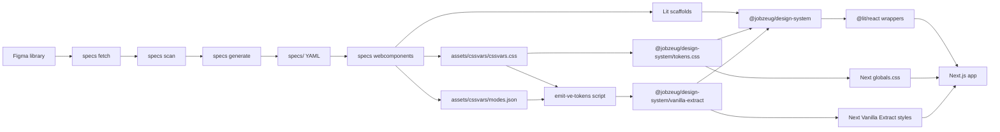

# Specs → Jobzeug Design System Game Plan

## Context (what already fits)

- [`packages/design-system`](packages/design-system) is already Lit-first (`jz-*`) with `@lit/react` wrappers — the same shape Specs’ experimental `specs webcomponents` target emits.
- App consumption is already wired: `JzButton` in [`src/components/resume-play-toolbar.tsx`](src/components/resume-play-toolbar.tsx), tokens via `@jobzeug/design-system/tokens.css`, scripts `ds:build` / `ds:dev`.
- Specs (Nathan Curtis / DirectedEdges) is the right automation layer: deterministic Figma → schema-valid YAML (0 AI tokens), then fan-out to Lit scaffolds — not agentic REST scraping.

Primary references:
- [Figma Component Specs on Command](https://nathanacurtis.substack.com/p/figma-component-specs-on-command) (Nathan)
- [Specs CLI overview](https://www.specsplugin.com/cli/) / [Getting started](https://www.specsplugin.com/cli/getting-started/)
- [GitHub DirectedEdges/specs](https://github.com/DirectedEdges/specs) · npm `@directededges/specs-cli`
- [`specs webcomponents`](https://www.specsplugin.com/cli/commands/webcomponents/) → Lit scaffolds via `@directededges/webcomponents-from-specs`



## Token / CSS variables strategy (shared by DS + app)

Goal: one set of **CSS custom properties** from Figma, usable inside Lit components **and** anywhere in the Next app (plain CSS or Vanilla Extract).

### What Specs already gives us

`specs webcomponents` emits a library-level stylesheet at `assets/cssvars/cssvars.css` — platform-neutral `--*` custom properties that component `*.host.css` files resolve against (`var(...)`). That is the mechanical token inventory from Figma variables / styles (quality depends on Pro + variables fetch; free tier still emits usable cssvars from available data, with more raw values in component CSS when bindings are missing). Specs also emits `assets/cssvars/modes.json` for mode/theme metadata.

### Chosen reuse path (concrete)

1. **Source of truth**: Specs-generated `assets/cssvars/cssvars.css` (regeneratable; do not hand-edit). Values live only here.
2. **Package export (CSS)**: ship as `@jobzeug/design-system/tokens.css` — already imported once in [`src/app/globals.css`](src/app/globals.css). Build step (extend [`copy-tokens.mjs`](packages/design-system/scripts/copy-tokens.mjs)) copies Specs cssvars → `dist/tokens/tokens.css`.
3. **Design system components**: Lit button styles use `var(--…)` from that sheet (Specs host CSS already does this). Replace hand-written [`src/tokens/tokens.css`](packages/design-system/src/tokens/tokens.css) with the generated sheet.
4. **Application reuse (plain CSS)**: after the root `@import`, any app CSS uses `var(--…)`.
5. **Application reuse (Vanilla Extract)** — post-process after Specs emit (see Phase 3a): a small script reads `modes.json` + the custom-property **names** from cssvars and generates a TypeScript module that maps token keys to **`var(--token-name)` strings only** — never hex/raw values. Export as `@jobzeug/design-system/vanilla-extract`. The site can wire that into `createThemeContract` / style helpers later; this plan ships the contract from the DS package, not a full VE migration of the Next app.
6. **Naming**: adopt Specs/Figma-emitted variable names as the canonical set for the pilot. Add a tiny `--jz-*` alias layer only if app code needs stable names that shouldn’t churn with Figma renames.
7. **Modes**: pilot uses default/light definitions in cssvars; mode switching via `modes.json` is a follow-on once Blueprints modes are clear.

### What this is not

- Not a first-party Specs Vanilla Extract target (we own the thin post-process).
- Not baking token values into VE — values stay in `tokens.css`; VE only holds `var(--…)` references.
- Not installing or migrating the whole Next app to Vanilla Extract in this plan — only the reusable contract export.
- Not requiring React context for tokens.

### Prereq note for good token names

Token *references* improve with **`SPECS_LICENSE_KEY` (Pro)** and a working **variables** fetch (Enterprise REST or Specs bridge). Free tier still produces cssvars; plan proceeds either way, with a quality check after first generate.

## Chosen approach

- **Home for Specs tooling**: under [`packages/design-system`](packages/design-system) (config, data, specs, generated Lit), so the package that ships components also owns the Figma sync.
- **Code target**: `specs webcomponents` (Lit), not `specs react`. Keep Jobzeug’s public API as Lit + thin React wrappers (current pattern).
- **Tokens**: Specs `cssvars.css` → `tokens.css` for everyone; post-process → VE contract of `var(--…)` refs only (Phase 3a).
- **Pilot first (one component only)**: **Blue Button** in Blueprints — the file is large, so do not generate the full library on the first pass. Prove fetch → generate → Lit → package build → resume toolbar on this single component, then expand the manifest later.
- **Authored vs generated**: treat Specs output as regeneratable; keep a thin authored layer for a11y, events, and `jz-` naming — same split Specs documents (scaffold vs owned file).

## Phase 0 — Prerequisites

### Source file (locked)

- **File URL**: [Blueprints-2026-09-22](https://www.figma.com/design/48XCsmDKWB6OqcsoDGteYt/Blueprints-2026-09-22)
- **File key**: `48XCsmDKWB6OqcsoDGteYt` → set as `data.sources.library.key` in `config/settings.yaml`
- **Pilot component**: **Blue Button** — [direct node link](https://www.figma.com/design/48XCsmDKWB6OqcsoDGteYt/Blueprints-2026-09-22?node-id=8-337&t=TS0eDx62cYflsLF8-1)
- **Pilot node id**: `8:337` (Figma URL form `8-337`) — after `specs scan`, select only this component (and any required subcomponents) in the manifest; or generate with `-c` / `--node` targeting this id if the CLI accepts it in bridge/single-component mode

### Secrets (still needed before `specs fetch`)

Yes — Specs needs a Figma personal access token (not the same as Figma MCP auth in Cursor).

- **`FIGMA_TOKEN`** — create at Figma Settings → Security → Personal access tokens with scopes: `file_metadata:read`, `file_content:read`, `library_assets:read`, `library_content:read`, `file_variables:read`
- Add to [`.env`](.env) and document empty keys in [`.env.example`](.env.example); never commit the token
- Specs CLI reads `FIGMA_TOKEN` from the environment / `.env` in the working directory (`packages/design-system` or repo root — wire dotenv consistently with Contentful scripts)

### Optional / plan-dependent

- **`SPECS_LICENSE_KEY`**: free tier = anatomy/props/variants/raw styles; Pro = token/variable bindings. Proceed without Pro if you don’t have one yet.
- **Variables**: Figma Variables REST is Enterprise-only. If this Blueprints file isn’t on Enterprise, fetch file+styles via REST and pull variables via Specs plugin CLI bridge (`--from-bridge`) when needed.

## Phase 1 — Scaffold Specs in the DS package

In [`packages/design-system`](packages/design-system):

1. Add `@directededges/specs-cli` as a **devDependency** (workspace-local `npx specs` / npm scripts — prefer not requiring a global install for the team).
2. Run `specs init` → `config/conventions/` + `config/settings.yaml`.
3. Point `data.sources.library.key` at `48XCsmDKWB6OqcsoDGteYt` (Blueprints-2026-09-22); set `data.directory` / `spec.directory` (e.g. `./figma-data`, `./specs`); fetch kinds start as `[file, styles]` and add `variables` only if Enterprise REST works.
4. Configure conventions for Jobzeug naming (`jz` tag prefix, glyph/subcomponent patterns) in `config/conventions/figma.yaml` and `web-components.yaml`.
5. Gitignore raw Figma dumps if large (`figma-data/*.json`); **commit** generated specs YAML and curated manifest (versioned source of truth for agents/CI).

Root scripts (mirror Contentful pattern):

- `ds:specs:fetch` / `ds:specs:scan` / `ds:specs:generate` / `ds:specs:wc`

## Phase 2 — First pipeline run (Blue Button only — node `8:337`)

Scope rule: **do not** check the full Ready-for-Dev set. The Blueprints file has a lot of components; this pass is a single-component pipeline proof.

1. `specs fetch` (whole file is fine — Specs needs the library snapshot).
2. `specs scan` → in the manifest, select **only** Blue Button matching node `8:337` (plus any nested subcomponents Specs requires). Leave everything else unchecked.
3. Prefer single-component generate when iterating: `specs generate … -c "<Blue Button name or 8:337>"` → review YAML under `specs/`.
4. `specs webcomponents --components <ThatKey> --no-stories` (Storybook later).
5. Wire tokens + button into the package:
   - Copy Specs `assets/cssvars/cssvars.css` into the existing `@jobzeug/design-system/tokens.css` export path (via build/`copy-tokens.mjs`).
   - Generated Lit → package entry; host CSS keeps using `var(--…)` from that sheet.
   - Optionally add a tiny `--jz-*` alias file only if app code needs stable names.
6. Re-export from [`src/index.ts`](packages/design-system/src/index.ts) / [`src/react/index.ts`](packages/design-system/src/react/index.ts); retire or thin the hand-authored [`button.ts`](packages/design-system/src/components/button.ts) once visual/API parity with the Figma blue button is verified.
7. `npm run ds:build`; smoke-test resume toolbar; smoke-test that app CSS can read the same CSS variables (e.g. one `var(--…)` usage in globals or a local style).

## Phase 3 — Package contract (stable for the app)

Keep the public surface stable while internals become Specs-driven:

- `@jobzeug/design-system` — register custom elements
- `@jobzeug/design-system/react` — `Jz*` wrappers
- `@jobzeug/design-system/tokens.css` — shared CSS custom-property sheet (Specs cssvars); app imports once in [`globals.css`](src/app/globals.css)
- `@jobzeug/design-system/vanilla-extract` — generated VE-ready token contract (Phase 3a)

Document in [`packages/design-system/README.md`](packages/design-system/README.md): regenerate flow, plain-CSS and VE reuse, what is safe to edit by hand, Specs schema attribution (CC BY 4.0 / Nathan Curtis).

## Phase 3a — Vanilla Extract post-process (thin; after Blue Button tokens exist)

Not a Specs feature — a Jobzeug script that runs after `specs webcomponents` / token copy.

1. Add [`packages/design-system/scripts/emit-ve-tokens.mjs`](packages/design-system/scripts/emit-ve-tokens.mjs) that:
   - Reads Specs `assets/cssvars/modes.json` and parses custom-property names from `cssvars.css` (or the copied `tokens.css`).
   - Writes a generated TS module (e.g. `src/vanilla-extract/tokens.ts` → `dist/vanilla-extract/`) exporting a nested or flat map where **every value is `"var(--name)"`** — never a raw color, size, or font stack.
2. Add package export `"./vanilla-extract"` in [`packages/design-system/package.json`](packages/design-system/package.json).
3. Hook into `ds:build` (after token copy) so regenerate stays one command.
4. Smoke: import the contract in a throwaway check or README example; confirm keys align with names in `tokens.css`. Do **not** install Vanilla Extract in the Next app or rewrite site styles in this plan — contract only.

Example shape (illustrative):

```ts
// generated — do not edit
export const tokens = {
  color: { primary: "var(--color-primary)" },
  space: { 2: "var(--space-2)" },
} as const;
```

## Phase 4 — Expand + automate

1. Widen manifest to more Ready-for-Dev components; regenerate in batches.
2. Agent pass per component only where Specs stops (behavior, a11y semantics, Jobzeug-specific API).
3. Optional later: wire `@jobzeug/design-system/vanilla-extract` into actual Next VE styles; scheduled CI for `fetch` + `generate`.
4. Demo narrative: Figma → Specs → Lit + CSS vars + VE contract → live resume UI.

## Out of scope for the first cut

- Generating / emitting any component other than Blue Button (`8:337`) and its required subcomponents
- `specs react` as the primary target (wrappers stay `@lit/react`)
- Full Storybook setup
- CI regeneration
- Installing Vanilla Extract in the Next app or migrating existing app CSS to VE
- Baking token **values** into the VE export (vars only)
- Replacing app layout/CSS wholesale with generated components beyond this one primitive

## Immediate next step after plan approval

1. Add `FIGMA_TOKEN` to `.env` (blocker for fetch).
2. Phase 1 scaffold against Blueprints file key `48XCsmDKWB6OqcsoDGteYt`.
3. Phase 2 **Blue Button only** (`8:337`) → Lit + tokens.css.
4. Phase 3a VE contract post-process (`var(--…)` only).
