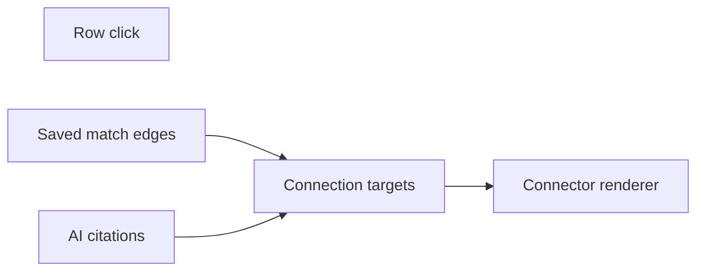

# Stage connection hub

Lines are one list. Each item is a target: a hub element, and the `data-evidence-id` rows that meet it. [evidence-connectors.tsx](src/components/resume/evidence-connectors/evidence-connectors.tsx) draws that list. It does not know whether the ids came from a click or from an answer. Today it assumes one card and looks for the answer footer inside that card. Measure each hub on its own element instead.

Two targets can be on screen together. They are not merged.

- **Selection** meets the top hub. A project click is that project plus every matched job line. A job-line click is that line plus every matched project. Clicking the selected row again clears it.
- **Answer** meets the bottom card. Ids stay `idsFromCitations` from [resume-highlight-context.tsx](src/components/resume/resume-highlight-context.tsx).

Neither target rolls the columns up. Highlight only the ids in the list.

## Stage

The center gutter in [answer-stage.module.css](src/components/stage/answer-stage/answer-stage.module.css) stays fixed and becomes two stacked regions, both mounted.

- **Top hub.** Project name and resume summary, or the job line’s section label and text. Nothing selected: one line of copy and no selection target.
- **Bottom.** The current AI stage in [answer-stage.tsx](src/components/stage/answer-stage/answer-stage.tsx), unchanged except that its lines use the answer target.

Clicks:

- Project row in [resume-document.tsx](src/components/resume/resume-document/resume-document.tsx) selects the project.
- Job line row in [job-posting-panel.tsx](src/components/job-posting/job-posting-panel/job-posting-panel.tsx) selects the line.
- Role and employer rows are not buttons.

That click is selection, not “add to question.” The composer still takes a typed question.

## Match edges, written once

The selection target reads edges. It does not score. Do not call `GET /api/job-posting/match` from the resume. Leave that route as it is.

`scorePostingAgainstCatalog` in [score.ts](src/lib/matching/score.ts) runs inside posting ingest, in [contentful.ts](src/lib/job-posting/contentful.ts), after line entries exist and before the posting is published. `POST` [src/app/api/job-posting/route.ts](src/app/api/job-posting/route.ts) already loads the catalog. One publish writes the posting, including the graph.

Store it on `jobzeugJobPosting` beside `matchingSnapshot`:

- `scoringVersion`
- `vocabularyVersion`
- `edges`: `{ projectId, lineEntryId, points }` where `points > 0`

`lineEntryId` and `projectId` are the row ids. Add the object field in [scripts/contentful/lib/schema.mjs](scripts/contentful/lib/schema.mjs), apply that content type, and return the graph on the panel payload in [schema.ts](src/lib/job-posting/schema.ts).

Binding a posting by id only reads the field. A posting saved before the field exists has no edges: the hub still shows the summary, and the selection target is only the clicked row, until that posting is processed again.
