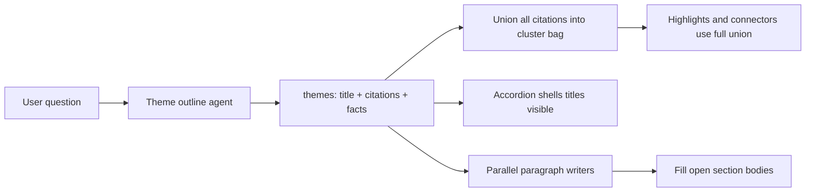

# Themed multi-section answers (outline → writers → accordion)

## What you have today (keep)

[`jobzeug-agent`](src/mastra/agents/jobzeug-agent.ts) does one turn: search evidence → one `citeEvidence` bag → freeform Markdown with bold lead-ins. The center stage ([`resume-answer-stage.tsx`](src/components/resume-answer-stage.tsx)) renders **one** blob; highlights are **turn-global** ([`EvidenceCluster`](src/lib/evidence-citations.ts)). That matches the screenshot’s “cool but long” card.

## Target experience



- **Generic accordion**: reusable single-open pattern in the answer stage — section titles always visible; **only one body open** at a time. Clicking another header closes the current one.
- **Highlights (this slice)**: keep today’s model — **everything cited stays highlighted**. Build one turn-level `citations` bag by **unioning** every theme’s `CiteEvidencePayload` (dedupe IDs). Rolled density + connectors keep working against that larger set.
- **Punt**: second highlight pass for the open/focused section only. No `activeSectionId` → `highlightedIds` filtering yet.

## Agent strategy (experiment, not a rewrite)

**Do not gut `jobzeug-agent`.** Add two small agents (same pattern as [`job-posting-structurer`](src/mastra/agents/job-posting-structurer.ts)):

| Agent | Role | Tools | Output |
|-------|------|-------|--------|
| `jobzeug-theme-outline` | Holistic answer plan | evidence workspace (+ same NEED system context as today) | Structured `themes[]` |
| `jobzeug-theme-writer` | One short paragraph | **None** | `{ themeId, markdown }` |

**Why split:** Outline owns search + citation integrity once. Writers only paraphrase locked facts → cheaper, parallel, less invention.

**Outline schema (new):** roughly

```ts
themes: Array<{
  id: string;           // stable slug for UI
  title: string;        // accordion header (= today’s bold lead-in)
  citations: CiteEvidencePayload; // per-theme (for later focus + for union now)
  facts: string[];      // short evidence-backed bullets for the writer
}>
```

**Writer input:** question + theme title + `facts[]` + optional NEED one-liners for cited `jobLines`. Output: 2–3 sentences, third-person advocate voice, **no new IDs**, no hedging — reuse voice rules from jobzeug-agent.

**Orchestration (efficient path):** new resume-only API (e.g. [`src/app/api/chat/themed/route.ts`](src/app/api/chat/themed/route.ts)) or `mode=themed` on chat — **not** a single streamed agent turn:

1. Run outline (structuredOutput / `generate`).
2. Stream/push themes to the client early (SSE or two-step JSON).
3. `Promise.all` writer calls (cap ~4 themes; truncate extras in outline instructions).
4. Return final cluster with sections filled **and** `citations = union(all theme citations)`.

Wall-clock: outline dominates; writers run in parallel and stay tool-less.

**Experiment wiring:** Resume `ask()` uses the themed route. Legacy [`/api/chat`](src/app/api/chat/route.ts) + `jobzeug-agent` remain for non-resume / fallback. Separate memory thread suffix e.g. `resume-themed:{sid}` so experiments don’t pollute the flat-answer thread.

## Data model / UI affordances

Extend cluster shape in [`evidence-citations.ts`](src/lib/evidence-citations.ts):

```ts
type AnswerSection = {
  id: string;
  title: string;
  markdown: string;       // empty while writing
  citations: CiteEvidencePayload; // kept per section for a future focus highlight
};

type EvidenceCluster = {
  // existing fields…
  sections?: AnswerSection[];
  citations: CiteEvidencePayload; // UNION of all section citations (drives highlights now)
  // answerMarkdown = join of sections for dock preview / fallback
};

function unionCitations(parts: CiteEvidencePayload[]): CiteEvidencePayload
```

- [`resume-highlight-context.tsx`](src/components/resume-highlight-context.tsx): **unchanged behavior** — still `highlightedIds = idsFromCitations(activeCluster.citations)` (the union bag).
- **Generic accordion UI** (new small component or inline in stage): list of headers; one expanded panel; used by [`resume-answer-stage.tsx`](src/components/resume-answer-stage.tsx) with `ChatMarkdown` in the open body. Open-section state is **UI-only** (local React state), not highlight state.
- Connectors: unchanged — still attach to card edge using the full union ID set.
- Dock: still selects by cluster id; accordion resets to first section open when re-selecting a cluster.

## Instruction / quality guardrails (prompts + context only — not a third agent)

- Outline: 2–4 themes; each must cite ≥1 C/R/S when making career claims; `jobLines` when NEED is bound; `facts` must be paraphrases of evidence, not vibes.
- Writer: only use `facts`; if thin, write a shorter paragraph — never invent metrics.
- Reuse advocate voice from jobzeug-agent; do not duplicate product/Jobzeug.md logic into writers (outline can refuse off-topic or answer product Qs as a single theme).

## Efficiency summary

| Phase | Parallel? | Cost |
|-------|-----------|------|
| Evidence search | Inside outline only | Once |
| Theme structure | Single structured call | Once |
| Paragraphs | Parallel N writers | N small calls |
| Citation bag | Union + dedupe on server | Free |
| Highlights | Existing turn-global path | Free |

## Out of scope for this slice

- Focus / open-section secondary highlight (and any dimming of non-open citations)
- Changing job-posting ingest or structurer
- Per-paragraph connector attach points
- Replacing Mastra memory observational features
- Fixing header underline CSS (separate issue)

## Implementation order

1. Schemas + types (`AnswerSection`, outline/writer Zod, `unionCitations`)
2. Two agents + register in [`src/mastra/index.ts`](src/mastra/index.ts)
3. Themed API route (outline → parallel writers → union citations onto cluster)
4. Generic accordion + wire into answer stage (UI open state only)
5. Point resume `ask` at themed path; keep legacy chat route
