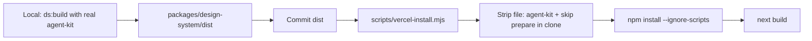

# Vercel: consume prebuilt design-system

## Why it fails

On Vercel, `npm install` runs [`packages/design-system`](packages/design-system/package.json) `prepare` → `node ./scripts/build.mjs`. That build typechecks files that import `@contentful/design-system-squared-agent-kit` from:

`file:../../../d2s-design-system-squared/packages/cli`

That path only exists on your machine. Vite JS output can succeed; `vite-plugin-dts` then fails with `TS2307`, install exits 1.

Root [`postinstall`](package.json) already uses `--soft`, but the workspace package’s hard `prepare` still runs and fails first.

## Approach (no permanent DS source edits)

Treat the design system as a **prebuilt workspace package** on CI:



1. **Commit `dist`** — exception in [`.gitignore`](.gitignore) so global `dist/` does not ignore the package output:

```gitignore
dist/
!packages/design-system/dist/
```

Add the current local `packages/design-system/dist/**` (JS, `.d.ts`, `tokens.css`, etc.) to git. App already imports `@jobzeug/design-system` / `tokens.css` from those exports.

2. **Vercel install script** — new [`scripts/vercel-install.mjs`](scripts/vercel-install.mjs) (runs only on the deploy clone; does not change the committed DS package permanently):

   - Read `packages/design-system/package.json`
   - Remove `@contentful/design-system-squared-agent-kit` from `devDependencies`
   - Remove or neutralize `prepare` (so a future scripted install cannot rebuild)
   - Assert `packages/design-system/dist/index.js` and `dist/designSystem/tokens.css` exist
   - Run `npm install --ignore-scripts`

3. **[`vercel.json`](vercel.json)** at repo root:

```json
{
  "installCommand": "node scripts/vercel-install.mjs",
  "buildCommand": "next build"
}
```

4. **Root [`package.json`](package.json) scripts**

   - `"build": "next build"` for CI/Vercel (prebuilt dist is the source of truth on deploy)
   - Keep `"ds:build"` for local regeneration when the sibling agent-kit is present
   - Keep `"postinstall": "node packages/design-system/scripts/build.mjs --soft"` for local convenience; on Vercel install uses `--ignore-scripts` so this won’t run there

5. **Short README note** (1–2 sentences): Vercel uses committed `dist`; after DS changes locally, run `npm run ds:build` and commit `packages/design-system/dist` before push.

## Out of scope

- No edits to Lit/tokens/components under `packages/design-system/src`
- No stubbing or vendoring of `@contentful/design-system-squared-agent-kit` into the repo
- No change to how local `file:` + `ds2` works on your machine

## Verify

- Locally: `node scripts/vercel-install.mjs` in a clean simulation is ideal; at minimum confirm `dist` is tracked and `next build` succeeds without running `ds:build`
- Push and confirm Vercel install/build pass on the next deployment
