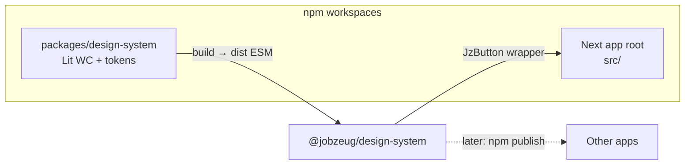

# Web-components design system next to Jobzeug

## Decision (locked)

- **Authoring:** [Lit 3](https://lit.dev) (TypeScript custom elements, Shadow DOM, CSS custom properties for tokens).
- **Layout:** Soft monorepo via **npm workspaces** — Next stays at repo root; DS lives in `packages/design-system`.
- **Consume path:** Prebuilt ESM package + `@lit/react` wrappers so App Router client components stay typed and idiomatic.
- **Publish:** Package shape is npm-ready (`exports`, `files`, typed entrypoints); initially consumed as a workspace dep (`"@jobzeug/design-system": "*"`). No separate repo yet.
- **First ship:** One example only — **`<jz-button>`**. No resume skeleton/collapse extraction.



## Package layout

```
packages/design-system/
  package.json          # name: @jobzeug/design-system
  tsconfig.json
  vite.config.ts        # library mode → dist/
  src/
    tokens/
      tokens.css        # --jz-* custom properties (source of truth)
    components/
      button.ts         # <jz-button>
    react/
      index.ts          # createComponent(JzButton)
    index.ts            # registers elements + re-exports
  dist/                 # gitignored; built on prepare/build
```

**Element prefix:** `jz-`.

**Root `package.json`:** `"workspaces": ["packages/*"]`, scripts `ds:build` / `ds:dev`, depend on `@jobzeug/design-system`.

**Next:** Prefer consuming **`dist`** (treat like an external package). Add `transpilePackages` only if pointing at unbuilt `src`.

## Build & exports

- **Vite library mode** → ESM + `.d.ts` (vite-plugin-dts).
- Package `exports`:
  - `"."` → registers custom elements + types
  - `"./react"` → Lit React wrappers
  - `"./tokens.css"` → token stylesheet
- Shadow DOM styles use **inherited** `--jz-*` from `:root` / host so consumers can theme without piercing shadows.

## `jz-button` (the example)

Minimal, reusable surface:

- Custom element: `<jz-button>`
- Props/attrs: `variant` (`primary` | `secondary`), `disabled`, optional `type` for form association later if easy
- Content: default slot (label)
- Events: forward `click` (Lit/native)
- Styles: tokenized padding, radius, colors, focus ring; primary filled / secondary outline
- React: `JzButton` from `@jobzeug/design-system/react`

```tsx
import { JzButton } from "@jobzeug/design-system/react";

<JzButton variant="primary" onClick={...}>Save</JzButton>
```

## Next.js wiring

1. `@import "@jobzeug/design-system/tokens.css"` in [`src/app/globals.css`](src/app/globals.css).
2. Client-only usage (`"use client"`) via the React wrapper.
3. Drop **one** live instance on an existing client surface (e.g. [`resume-play-toolbar.tsx`](src/components/resume-play-toolbar.tsx) or home) so the build + import path is proven — not a redesign of resume UI.
4. No Lit SSR on day one.

## Explicit non-goals (this pass)

- No skeleton bar, overlay-collapse, or other resume primitive extraction.
- No Storybook yet.
- No moving the Next app into `apps/web`.
- No Tailwind inside Shadow DOM; Tailwind stays for app chrome around DS elements.

## Why this fits

- Same reusable WC architecture, smaller first proof.
- Easy to add the next `jz-*` element later without changing packaging.
- Publish path stays mechanical (`npm publish` from `packages/design-system`).
